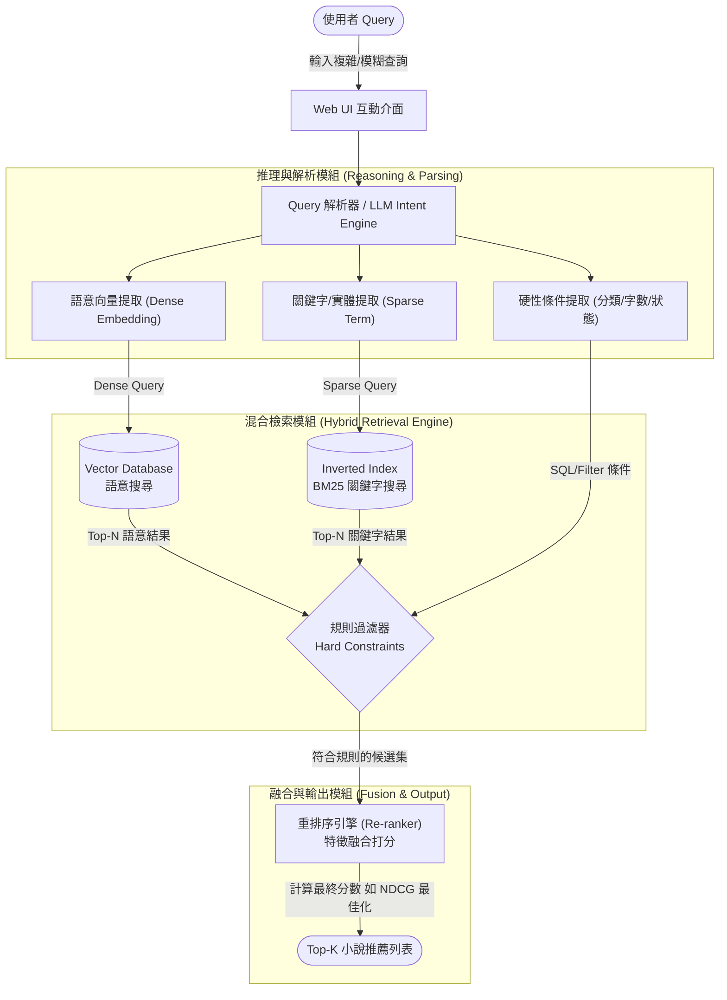

# 系統架構 (System Architecture)

```mermaid
graph TD
    %% 節點定義
    User([使用者 Query])
    UI[Web UI 互動介面]
    
    subgraph "推理與解析模組 (Reasoning & Parsing)"
        Parser[Query 解析器 / LLM Intent Engine]
        HardFilter["硬性條件提取 (分類/字數/狀態)"]
        SemanticExtractor["語意向量提取 (Dense Embedding)"]
        KeywordExtractor["關鍵字/實體提取 (Sparse Term)"]
    end
    
    subgraph "混合檢索模組 (Hybrid Retrieval Engine)"
        VectorDB[("Vector Database<br>語意搜尋")]
        TextDB[("Inverted Index<br>BM25 關鍵字搜尋")]
        RuleEngine{規則過濾器<br>Hard Constraints}
    end
    
    subgraph "融合與輸出模組 (Fusion & Output)"
        Reranker["重排序引擎 (Re-ranker)<br>特徵融合打分"]
        Result([Top-K 小說推薦列表])
    end

    %% 資料流向
    User -->|輸入複雜/模糊查詢| UI
    UI --> Parser
    
    Parser --> HardFilter
    Parser --> SemanticExtractor
    Parser --> KeywordExtractor
    
    SemanticExtractor -->|Dense Query| VectorDB
    KeywordExtractor -->|Sparse Query| TextDB
    
    VectorDB -->|Top-N 語意結果| RuleEngine
    TextDB -->|Top-N 關鍵字結果| RuleEngine
    HardFilter -->|SQL/Filter 條件| RuleEngine
    
    RuleEngine -->|符合規則的候選集| Reranker
    Reranker -->|計算最終分數 如 NDCG 最佳化| Result
    
    class Parser,Reranker highlight;
    class VectorDB,TextDB database;
```
