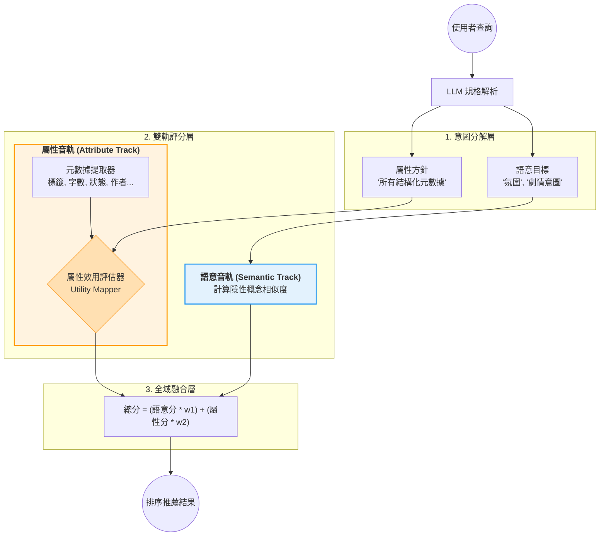
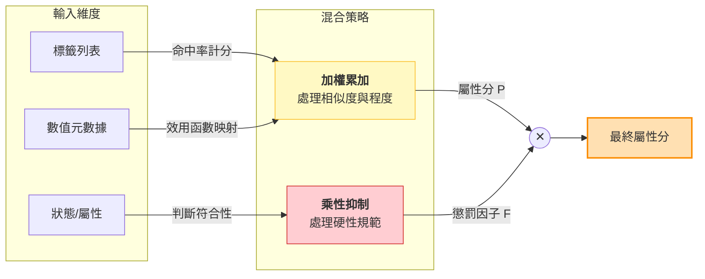

# 實驗與方法評估

## 核心引擎架構：語意-屬性雙軌模型 (Semantic-Attribute Dual-Track Model)

本專案的推薦引擎採用**二元特徵評價架構**，將使用者的查詢意圖分解為兩條獨立且互補的評分音軌：

- **語意音軌 (Semantic Track)**：處理隱性語意，即「劇情氛圍」、「內容意圖」等無法用單一標籤定義的特徵。透過向量空間的餘弦相似度進行計算。
- **屬性音軌 (Attribute Track)**：處理所有顯性結構化元數據，包括標籤 (Tags)、連載狀態、字數、作者等。透過屬性效用評估器 (Utility Mapper) 進行統一計分。

### 屬性效用評估器 (Utility Mapper) 內部混合機制

屬性音軌中的效用評估器將不同類型的結構化元數據統一處理，其內部混合邏輯分為兩種策略：

1.  **加權累加 (Additive Aggregation)**：處理標籤命中率、數值程度等「越多越好 / 越高越好」的維度。
2.  **乘性抑制 (Multiplicative Regulation)**：處理狀態、字數、作者等硬性規範。違反時分數乘以 `PENALTY_MULTIPLIER (0.05)`，大幅壓低但不為零。

---

## 實驗主題：屬性音軌中「標籤處理方式」的比較

本實驗的核心在於探討：**在屬性音軌內部，標籤 (Tags) 應以何種方式進行效用評估？** 以下五種方法皆可套用在上述的雙軌模型中，差異僅在於「屬性效用評估器」處理標籤的策略不同：

### 方法 1. LLM 直接生成 + SQL 硬比對 (Baseline)
 
- **說明**：LLM 自由生成欲篩選的標籤關鍵字，由 SQL 對資料庫書籍標籤進行模糊比對。
- **效用計算**：`U_tags = 0.1 + 0.9 * (命中數 m / 目標數 n)`
- **特點**：系統基準做法。檢索分為語意向量搜尋 (Path A) 與 SQL 標籤搜尋 (Path B) 兩路。

### 方法 2. 提供完整標籤集給 LLM + SQL 硬比對

- **說明**：在 LLM 解析時提供系統中所有現有標籤作為參考，讓產生的標籤更精準。
- **效用計算**：同方法 1。
- **特點**：架構不變，僅優化「意圖分解層」的輸入品質，減少 LLM 幻覺或無效匹配。

### 方法 3. LLM 直接生成 + Embedding 相似度比對

- **說明**：允許 LLM 自由生成標籤，再透過 Embedding 計算 LLM 標籤與系統標籤之間的語意相似度，以此作為效用分。
- **效用計算**：`U_tags` 改由向量相似度得分決定（連續值），而非二元命中。
- **特點**：屬性效用評估器從「字面匹配」升級為「語意匹配」，即使 LLM 生成的標籤不完全吻合系統標籤，仍能找到最相近的對應。

### 方法 4. 標籤融入文本 Embedding (特徵融合)

- **說明**：將書籍的標籤直接與小說簡介合併，共同進行 Embedding 運算。
- **語意音軌變化**：標籤被「隱性化」融入語意空間，語意音軌同時承擔了部分屬性判斷。
- **屬性音軌變化**：標籤不再經過效用評估器。屬性音軌僅保留字數/狀態等硬性規範的乘性抑制功能。
- **特點**：打破了雙軌的邊界，將部分顯性屬性遷移至語意軌。

### 方法 5. 獨立多向量空間 (Multi-Vector)

- **說明**：為書籍的「書名與簡介」與「標籤」分別建立獨立的向量空間（`text_semantic` 與 `tag_semantic`），檢索時獨立計算相似度，再融合。
- **效用計算**：`U_tags = 0.1 + 0.9 * TagVectorSimilarity`
- **特點**：屬性音軌的「標籤處理工具」升級至與語意音軌同等的向量等級，實現多向量 Late Interaction。

### 各實驗在雙軌架構下的對比

| 實驗 | 語意音軌 | 屬性音軌 (標籤處理) | 屬性音軌 (硬性規範) |
| :--- | :--- | :--- | :--- |
| **1** | 文字向量 | SQL 硬比對 | 乘性懲罰 (x0.05) |
| **2** | 文字向量 | SQL 硬比對 (LLM 參考完整標籤) | 乘性懲罰 (x0.05) |
| **3** | 文字向量 | Embedding 相似度比對 | 乘性懲罰 (x0.05) |
| **4** | 文字+標籤混合向量 | *(標籤已遷入語意軌)* | 乘性懲罰 (x0.05) |
| **5** | 文字向量 | 標籤專屬向量空間 | 乘性懲罰 (x0.05) |

---

## 分數融合策略 (Fusion Strategies)

語意音軌與屬性音軌的分數可透過以下兩種策略進行全域融合：

### A. 線性加權融合 (Additive Fusion)
- **公式**：`Total = SemanticScore * w1 + AttributeScore * w2`
- **特點**：兩條音軌的貢獻是獨立且線性的。可透過調整 `w1` 與 `w2` 的比例（如 0.7:0.3 或 0.1:0.9）來控制引擎偏好。

### B. 乘法模型融合 (Multiplicative Fusion)
- **公式**：`Total = SemanticScore * AttributeScore`
- **縮放**：各項分數透過 `0.1 + 0.9 * x` 對齊至 [0.1, 1.0]，避免單項不匹配導致總分為零。

---

## 評分與評估方式 (Evaluation)

本專案全面採用 **LLM-as-a-Judge** 自動化評分機制 (`src/eval/llm_judge.py`)。

- **評分標準 (0-3 分)**：
  - **3 分 (Highly Relevant)**: 完美符合核心需求與偏好。
  - **2 分 (Partially Relevant)**: 符合部分關鍵需求。
  - **1 分 (Marginally Relevant)**: 僅有邊緣關聯。
  - **0 分 (Irrelevant)**: 完全無關，或資訊缺失。
- **評估指標 (Metrics)**:
  - 採用 **NDCG@10** 衡量各推薦引擎的排序品質。
  - **強硬條件仲裁 (Strict Filter)**：即便引擎改用 Soft Penalty (0.05x) 保留違規書籍，在計算 NDCG 前仍會透過 `src/eval/metrics.py` 審查，若書籍違反使用者明確的硬性規則，其得分會被強制歸零。
