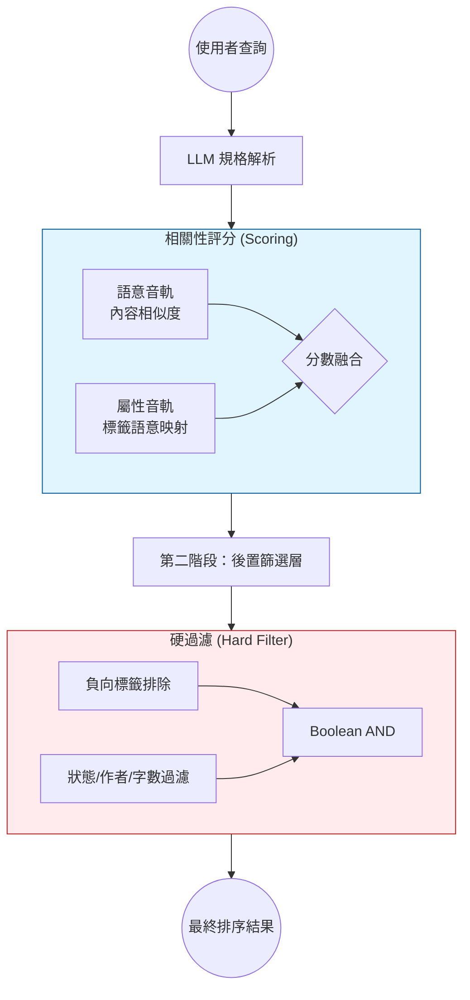

# 實驗與方法評估

## 核心引擎架構：雙軌評分 + 後置篩選 (Dual-Track Scoring + Post-Filtering)

本專案的推薦引擎採用**相關性評分與硬性約束分離**的架構：

1.  **內容相關性評分 (Content Scoring)**：採用雙軌模型計算書籍與需求的符合程度。
    - **語意音軌 (Semantic Track)**：處理隱性語意，如「劇情氛圍」、「內容意圖」。透過內容向量 (text_vector) 計算。
    - **屬性音軌 (Attribute Track)**：處理標籤 (Tags) 的語意匹配，將標籤視為一種顯性屬性的語意強度。
2.  **後置篩選層 (Post-Filter Layer)**：處理硬性約束，如負向標籤、特定作者、字數範圍、完結狀態。不符合者直接移除，不參與排序。

### 執行流程：兩階段處理

#### 1. 相關性評分 (Attribute Track / Tags)
在目前的架構中，屬性音軌專注於**標籤的語意質量**。不再處理字數或狀態的計分，這些已移往篩選層。

#### 2. 後置篩選規則 (Hard Filter Logic)
以下維度在引擎完成初步評分後進行 Boolean 判斷：
- **負向標籤**：透過語意映射將用戶排除詞 (e.g. "不要虐") 轉為系統標籤，命中即移除。
- **顯性元數據**：作者、完結狀態、字數範圍必須 100% 符合。

---

## 實驗主題：屬性音軌中「標籤處理方式」的比較

本實驗的核心在於探討：**在屬性音軌內部，標籤 (Tags) 應以何種方式進行效用評估？** 以下五種方法皆可套用在上述的雙軌模型中，差異僅在於「屬性效用評估器」處理標籤的策略不同：

### 方法 1. LLM 直接生成 + SQL 硬比對 (Baseline)
 
- **說明**：LLM 自由生成欲篩選的標籤關鍵字，由 SQL 對資料庫書籍標籤進行模糊比對。
- **效用計算**：`U_tags = 0.1 + 0.9 * (命中數 m / 目標數 n)`
- **特點**：系統基準做法。檢索分為語意向量搜尋 (Path A) 與 SQL 標籤搜尋 (Path B) 兩路。

### 方法 2. 提供完整標籤集給 LLM + SQL 硬比對

- **說明**：在 LLM 解析時提供系統中所有現有標籤作為參考，讓產生的標籤更精準。
- **效用計算**：同方法 1。
- **特點**：架構不變，僅優化「意圖分解層」的輸入品質，減少 LLM 幻覺或無效匹配。

### 方法 3. 標籤面向映射 + MaxSim 評分 (Individual Tag Mapping)

- **說明**：將使用者要求的各個標籤視為獨立的「意圖面向 (Facets)」。先將每個要求詞語意映射到系統標籤集，再對書籍標籤進行 MaxSim 計算。
- **效用計算**：`U_tags = Average(對每個面向的最優匹配分數)`。
- **特點**：精確度最高的方法。能識別如「系統流」映射到「系統」的語意關聯，且不會因為標籤多寡稀釋單一核心需求的權重。

### 方法 4. 標籤融入文本 Embedding (特徵融合)

- **說明**：將書籍的標籤直接與小說簡介合併，共同進行 Embedding 運算。
- **語意音軌變化**：標籤被「隱性化」融入語意空間，語意音軌同時承擔了部分屬性判斷。
- **屬性音軌變化**：標籤不再經過效用評估器。屬性音軌僅保留字數/狀態等硬性規範的乘性抑制功能。
- **特點**：打破了雙軌的邊界，將部分顯性屬性遷移至語意軌。

### 方法 5. 獨立多向量空間 (Multi-Vector)

- **說明**：為書籍的「書名與簡介」與「標籤」分別建立獨立的向量空間（`text_semantic` 與 `tag_semantic`），檢索時獨立計算相似度，再融合。
- **效用計算**：`U_tags = 0.1 + 0.9 * TagVectorSimilarity`
- **特點**：屬性音軌的「標籤處理工具」升級至與語意音軌同等的向量等級，實現多向量 Late Interaction。

### 各實驗在雙軌架構下的對比

| 實驗 | 語意音軌 | 屬性音軌 (標籤處理) | 硬性約束執行方式 |
| :--- | :--- | :--- | :--- |
| **1** | 文字向量 | 字面模糊比對 (SQL-like) | **直接過濾 (Hard Exclusion)** |
| **2** | 文字向量 | 字面模糊比對 (LLM 參考完整標籤) | **直接過濾 (Hard Exclusion)** |
| **3** | 文字向量 | **面向映射 + MaxSim 語意匹配** | **直接過濾 (Hard Exclusion)** |
| **4** | 文字+標籤混合向量 | *(標籤已遷入語意軌)* | **直接過濾 (Hard Exclusion)** |
| **5** | 文字向量 | **標籤全域向量 (Joined Vector)** | **直接過濾 (Hard Exclusion)** |

---

## 分數融合策略 (Fusion Strategies)

語意音軌與屬性音軌的分數可透過以下兩種策略進行全域融合：

### A. 線性加權融合 (Additive Fusion)
- **公式**：`Total = SemanticScore * w1 + AttributeScore * w2`
- **特點**：兩條音軌的貢獻是獨立且線性的。可透過調整 `w1` 與 `w2` 的比例（如 0.7:0.3 或 0.1:0.9）來控制引擎偏好。

### B. 乘法模型融合 (Multiplicative Fusion)
- **公式**：`Total = SemanticScore * AttributeScore`
- **縮放**：各項分數透過 `0.1 + 0.9 * x` 對齊至 [0.1, 1.0]，避免單項不匹配導致總分為零。

---

## 評分與評估方式 (Evaluation)

本專案全面採用 **LLM-as-a-Judge** 自動化評分機制 (`src/eval/llm_judge.py`)。

- **評分標準 (0-3 分)**：
  - **3 分 (Highly Relevant)**: 完美符合核心需求與偏好。
  - **2 分 (Partially Relevant)**: 符合部分關鍵需求。
  - **1 分 (Marginally Relevant)**: 僅有邊緣關聯。
  - **0 分 (Irrelevant)**: 完全無關，或資訊缺失。
- **評估指標 (Metrics)**:
  - 採用 **NDCG@10** 衡量各推薦引擎的排序品質。
  - **負向條件仲裁**：由於引擎已實現「後置篩選層」，任何違反硬性規則（如包含負向標籤、字數不合）的書籍皆不會出現在檢索結果中，因此在評估階段不再需要額外的過濾邏輯。
