# 基於 RAG 與混合檢索的輕小說查詢系統

## 計畫摘要 Abstract

隨著網路文學市場規模逐年擴大，現有依賴手動勾選標籤的結構化檢索系統已顯得過於僵硬，無法滿足使用者口語化與情境化的搜尋需求；而直接導入大型語言模型（LLM）的搜尋系統，則常面臨「語義偏移」、「標籤幻覺」以及處理複雜約束條件時容易發生格式解析崩潰等不穩定問題。為解決此痛點，本專題開發了一套結合 LLM 與規則導向（Rule-based）邏輯的混合式網路小說檢索引擎。

本系統的核心技術包含：透過「混合權重標籤模板嵌入」將使用者的模糊意圖精確對齊至系統預定義標籤；導入「引導式任務解構」將查詢解析拆分為語意理解、標籤投影與結構過濾平行處理；並創新提出「任務導向的差異化輸出策略」，徹底解決了單一 JSON 格式所引發的長尾延遲與解析失敗問題，最後輔以 PermSC 重排序機制動態優化候選排序。

綜合實驗成果顯示，本系統不但將結構化解析成功率拉升至 100%，徹底消除長尾延遲，更在進階檢索品質指標（如 pNDCG 與 mAP）上全面超越傳統的關鍵詞與純向量檢索方法。本研究成功兼顧了模糊語意檢索的彈性與排序品質的穩定性，最終提供使用者一個精準、穩定且具備高度解釋性的自然語言小說檢索體驗。

## 一、目錄 Contents

略

## 二、前言 Introduction

### 研究背景

在網路文學產值逐年增長的背景下，網路小說（特別是輕小說）的數量與市場規模變得極為龐大。然而，輕小說特有的語境（例如「轉生」、「傲嬌」、極長且敘述性的標題）使得傳統依賴手動勾選標籤的檢索介面顯得過於僵硬，無法應對這類高度口語化、充滿特定梗或模糊的查詢需求。此外，雖然近年興起了導入 AI 技術的搜尋工具，但這些新興搜尋系統在解析使用者意圖時往往缺乏穩定性。

### 相關研究

#### 傳統結構化檢索系統對比

現有的網路小說推薦領域大多仰賴結構化的檢索方式（如手動勾選分類與標籤）。這類系統的優勢在於搜尋結果絕對精確且不會超出規則邊界，但缺點是其檢索介面過於僵硬，完全無法處理包含情緒、複雜情境或是長句型的自然語言查詢。

#### 既有純 LLM 檢索的侷限

雖然自然語言處理技術已大幅進步，但直接讓 LLM 生成搜尋語法（DSL）或標籤，極易產生「標籤幻覺」（生成系統資料庫中不存在的標籤）或是「語義偏移」（字面意義接近但實質分類不同）的問題。同時，在單次 LLM 查詢中同時處理語意理解、擴展關鍵詞與硬條件抽取，常會導致模型無法兼顧所有條件，進而忽略部分篩選規則。

## 三、研究動機與研究問題 Motivation and Research Problem

### 3.1 研究動機與核心痛點

隨著網路文學（特別是輕小說）市場規模在社群演算法的推波助瀾下爆發式增長，作品數量已呈海量化發展。輕小說文本具有極度獨特的文化語境，包含極長且具敘事性的標題、大量圈內社群梗以及高度口語化的讀者偏好描述。然而，現有的檢索技術在面對這類高度情境化、充滿隱喻的自然語言查詢時，存在以下三層核心技術痛點：

- **傳統結構化檢索的剛性壁壘**
    現有網路小說平台大多仰賴傳統的分類標籤與手動勾選介面。這類系統雖然邊界明確，但其檢索介面過於僵硬，完全無法處理包含情緒、複雜情境或長句型的模糊意圖查詢。例如當使用者輸入「想看主角一開始很廢但後面開外掛，且女主角不能戴綠帽的日常爽文」時，傳統系統將因無法解析複合語意而徹底失效。
- **純 LLM 檢索的架構雙重困境**
    為賦予搜尋引擎語意理解能力，近年興起直接導入 LLM 的自然語言檢索系統。然而，直接讓模型生成資料庫搜尋語法或標籤時，常面臨標籤幻覺（生成系統不存在的標籤）與語義偏移（無法將社群俚語精準映射至預定義標籤）的雙重困境。此外，孤立的分類詞彙在向量空間中缺乏充足的消歧義深度，導致純密集向量檢索的召回品質不穩。
- **單體工程實作的格式破碎與長尾延遲**
    在實務開發管線中，若採用傳統的聯合式單次解析，強迫單個模型在單次呼叫中同時處理語意理解、硬條件抽取與結構化資料輸出，極易導致模型因處理維度過多而發生格式崩潰，結構化解析成功率大幅滑落；同時，全量上下文的傳遞也容易讓模型陷入重複生成的循環陷阱，引發嚴重的長尾延遲與超時斷線。

### 3.2 研究問題

為從根本上解決自然語言查詢與剛性結構化資料庫之間的對齊與穩定性問題，並為後續的優化實驗提供理論依據，本研究聚焦於解答以下四個核心研究問題：

- **【RQ1】語意與分類標籤的雙軌映射與權重調配問題**
    如何在保留自然語言模糊查詢彈性的同時，消除標籤幻覺與語義偏移，將高度口語化的查詢句精確映射至預定義的標籤集？此外，如何結合小說簡介的文本語意與預定義的標籤屬性分數，找出最佳的混合評分權重比例？
- **【RQ2】複合查詢下的工程穩定性與延遲收斂問題**
    如何設計推論管線與回應格式，使其在面對集成了長文推理（模糊性）與屬性提取（剛性）的複合查詢時，在程式端實現決定性合併，從而兼顧 100% 的格式解析成功率並徹底根除長尾延遲？
- **【RQ3】列表層級重排序與硬性合規限制的權衡問題**
    在檢索後的重排序階段，如何有效運用多排列一致性投票機制提升列表層級的排序品質，同時透過動態權重調配與候選池規模控制，確保系統不犧牲對硬性過濾條件（如字數限制、完結狀態）的合規底線？
- **【RQ4】混合推論架構與傳統單模態檢索的效能對比問題**
    本專題所提出結合 LLM 推理與規則導向的混合推論引擎，在面對高度情境化的小說查詢時，其排序品質指標（如 pNDCG、NDCG、Precision、mAP）是否能全面且顯著地超越傳統的關鍵詞檢索、純密集向量檢索及天真倒數秩融合等傳統基線方法？

### 3.3 研究目的

本專題旨在開發一套基於 RAG 與混合檢索的輕小說查詢系統，建立一套結合 LLM 與規則導向邏輯的混合推論引擎。具體研究目的包含：

1. **建置混合權重標籤模板嵌入機制**：透過對稱式模板與標籤描述的加權融合，賦予孤立分類詞彙充足的語意消歧義深度，並透過消融實驗找出書籍簡介與標籤分數的最佳混合配比。
2. **設計引導式任務解構架構**：將高耦合的單體解析重構為多分支並行處理架構，拆分為語意理解、標籤投影與結構化過濾三個獨立分支，並透過並行處理與上下文傳遞實現決定性合併。
3. **實施任務導向的差異化輸出策略**：針對不同分支任務的本質，量身打造專屬的回應格式規範（包含自由標記式區段、輕量化上下文與固定 4-Key JSON 綱要），從根本上解決格式破碎與長尾延遲。
4. **導入 PermSC 動態重排序機制**：透過多排列的一致性投票與動態權重調配，在享有 LLM 語意理解紅利的同時，最大化恢復系統對硬性合規能力的保障，並調校出最佳的候選池召回限制。

### 3.4 預期成果與工程價值

本專題預期完成一套具備高度穩定性與精準度的混合式輕小說檢索引擎，其預期達成之技術指標與實務工程價值如下：

- **全面提升系統解析成功率與健全度**
    預期透過引導式任務解構與差異化輸出策略，從根本解決 LLM 在複雜約束下格式破碎的致命瓶頸，將結構化篩選的 SDK 解析成功率拉升至 100.0%；同時，藉由輕量化上下文技術，有效收斂運作延遲，徹底根除極端長尾延遲與超時斷線問題。
- **顯著優於傳統基線的檢索排序品質**
    本研究不追求單一模態的召回，而是聚焦於精準排序。系統預期在 pNDCG@k、NDCG@k、Precision@k 以及 mAP@k 等進階資訊檢索指標上，全面且顯著地超越傳統的 BM25 關鍵詞檢索、純密集向量檢索以及天真倒數秩融合等傳統基線方法，證明混合推論引擎能更精準地捕捉用戶的深層語意需求。
- **建立新一代混合式檢索範式**
    本專題之架構成功兼顧了模糊語意理解的彈性與規則導向系統的剛性穩定度。在工程實務上，本研究展示了如何透過差異化回應格式與動態重排序機制，在享受 LLM 文字理解紅利的同時，不犧牲系統對硬性合規能力的保障，為網路文學檢索與垂直領域商用推薦系統提供具備高度可觀測性與高穩定度的實踐參考。

## 四、研究方法與系統架構

### 4.1 系統混合架構總覽 (Overview of Hybrid Architecture)

本系統捨棄了傳統的單一模態檢索，亦不依賴不穩定的 LLM 單體解析，而是提出一套結合語意推理、精準映射與規則導向的**混合推論引擎**。整體流程分為三大核心階段：
1. **引導式查詢解析**：將用戶的自然語言查詢解構為語意、標籤與結構條件平行處理。
2. **混合推論與標籤映射**：透過相似度聚合將自然語言對齊系統既有標籤，並套用嚴格的結構化過濾規則。
3. **動態重排序**：將初篩後的候選池送入基於 PermSC 機制的重排序器，透過 LLM 的判斷力進行最後階段的精準排列。

### 4.2 資料前處理與雙軌索引建置 (Data Preprocessing & Dual-Track Indexing)

在檢索系統運作前，需先針對原始書籍資料進行標準化與特徵提取，建立雙軌資料庫：一段負責結構化過濾，一段負責語意與標籤相似度計算。

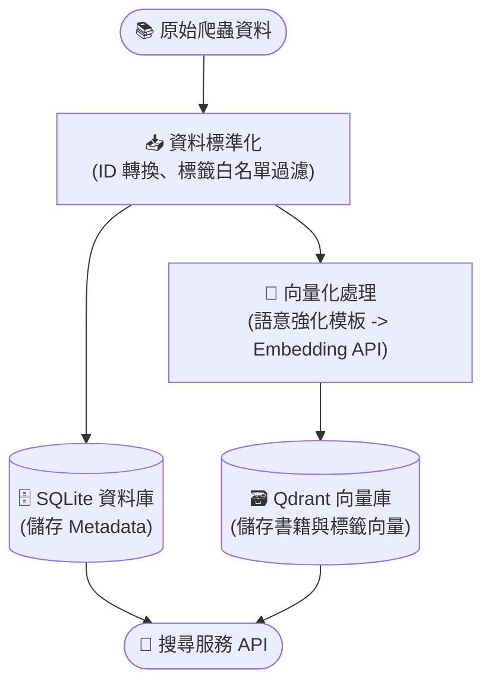

- **屬性與內容索引**：書籍名稱、作者與過濾用的 Metadata 存入關聯式資料庫 (SQLite)；書籍標題與簡介則向量化存入向量資料庫 (Qdrant)。
- **混合權重標籤模板嵌入**：為了提升後續標籤映射的準確度，系統將標籤本身的語境化模板（`這部作品的類型偏向{label}`）與標籤詳細說明文字進行加權向量化，讓孤立的分類詞彙擁有充足的消歧義語意深度。

### 4.3 引導式任務解構解析模組

傳統將語意理解、過濾抽取等任務交由單次 LLM 生成的方式極不穩定，容易發生條件互斥或遺漏。因此，系統將查詢解析重構為多分支的**並行處理架構**：

1. **語意理解分支**：專注於推敲使用者的核心意圖與偏好基調，並整理出「上下文摘要」，作為其他分支的參照。
2. **標籤投影分支**：根據前置語意，挑選出最貼合的正向概念（如題材、元素）與負向概念（想避開的毒點）。
3. **結構化過濾分支**：採用「槽位填充」的方式，專注提取客觀數據（如字數限制、完結狀態）。

分支結果最終透過系統邏輯進行決定性合併，在享受 LLM 思考彈性的同時，保留規則導向系統的準確底線。

### 4.4 任務導向的差異化輸出策略

為解決 LLM 輸出 JSON 易崩潰及導致長尾延遲的問題，本模組放棄全局統一的約束，為不同任務量身打造回應格式（Response Schema）：
- **自由標記式區段**：語意分支允許較長的推論過程，改用 Markdown 結構讓模型能自由表達思考，大幅降低因特殊字元導致解析失敗的問題。
- **輕量化上下文**：標籤投影分支藉由精簡上下文輸入，防止模型產生「生成循環陷阱」，顯著消除了系統極端延遲。
- **固定 4-Key JSON 綱要**：針對對精確度要求極高的結構化分支，強制其只輸出極為簡化的特定欄位格式，使 SDK 結構化解析成功率達 100%。

### 4.5 標籤語意映射與混合檢索邏輯

取得解析結果後，系統進入實際查詢階段，採取「評分與篩選分離」的機制：

1. **標籤映射與相似度聚合**：透過向量資料庫計算目標偏好與系統現有標籤的相似度，並以聚合方式整理各標籤對作品屬性的貢獻，避免單一作品因具備過多旁支標籤導致整體分數被稀釋。
2. **混合權重評分**：將作品簡介與查詢句的直接語意相似度，與前述的標籤屬性分數，按照特定比例（如 7:3 或 2:8）混合，以兼顧氛圍上的相似與具體元素的吻合。
3. **結構與負向攔截**：一旦分數結算完成，對於不符合硬性條件（完結與否、字數）以及觸發負向標籤高分閾值的作品，將直接從候選名單中剔除。

### 4.6 PermSC 動態重排序機制

由於向量檢索擅長廣度召回，本系統在第一階段（Recall Limit，如 50 筆或 100 筆）後，會將候選名單交由 LLM 利用 **Permutation Self-Consistency (PermSC)** 機制進行最終精修。

- 取代傳統的純分數排序，針對候選清單進行多排列的一致性投票，藉助 LLM 深度的文字理解模型能力，提升列表層級的排序品質。
- 設計動態權衡策略，擴大 Recall Limit 並偏重視標籤權重（如 8:2），能使系統在具備語境理解優勢的同時，不會因為重排序機制的擾動而犧牲掉對合規性的硬約束保障。

## 五、結果及討論 Research Results an Conclusions

為驗證並最佳化本專題之系統效能，本研究進行了多項核心實驗：

### 5.1 實驗一：標籤模板嵌入語境比較

#### 5.1.1 實驗背景與目的

本專題之檢索引擎採用「兩階段標籤映射」策略：先由 LLM 生成描述性標籤，再透過 Embedding 向量模型將其映射至資料庫中真實存在的標籤。然而，單純的標籤詞彙在向量空間中常因缺乏語境而導致語義模糊（例如「JK」可能被視為隨機字母而非「女高中生」類型）。本實驗旨在測試不同模板對標籤映射準確度的影響，找出最佳的語意引導方式。

#### 5.1.2 實驗設定

- 模型與參數：採用 `gemini-embedding-001` 模型，限制候選集為系統核心之 60 個標籤。
- 方法論：
    1. **對稱式模板策略 (Symmetric)**：在預處理端與查詢端套用相同語境（`這部作品的類型偏向{label}`）。
    2. **純標籤描述策略 (Desc)**：僅使用標籤的詳細說明作為 Embedding，測試單純語義描述在無標籤名稱干擾下的檢索能力。
    3. **混合權重語義強化 (Hybrid)**：將上述兩組 Embedding 進行加權融合，以兼顧標籤詞彙的精確度與描述文字的語義深度。計算方式如下：

    $$\text{Score} = w_s \cdot S_{\text{sym}} + w_d \cdot S_{\text{desc}}$$

    (其中 $w_s = 0.7, w_d = 0.3$)
- 評測指標：針對 408 組模擬查詢，計算其 Top-1、Top-3（系統預設召回數）及 Top-5 之累積準確率（CMC），並額外觀察在多標籤召回（K=3）下的過濾穩定性。
  
#### 5.1.3 實驗結果與數據分析

實驗對比了原始標籤（Raw Label）、對稱模板（Symmetric）、單純標籤描述（Desc）以及引入說明文字的混合策略（Hybrid Weight）。下表列出其累積準確率之對比：

| 指標 (K 值) | Raw (基準) | Symmetric (對稱模板) | Desc (單純描述) | **Hybrid (語義強化)** |
| :--- | :--- | :--- | :--- | :--- |
| **Top-1 Accuracy** | 80.64% | 86.27% | 83.58% | **89.71%** |
| **Top-3 Accuracy** | 90.20% | 94.36% | 94.85% | **96.81%** |
| **Top-5 Accuracy** | 92.40% | 95.83% | 97.30% | **97.30%** |

#### 5.1.4 討論與發現

*   **語意激活與偏移修正**：透過詳細相似度分析發現，模板（Symmetric）能顯著提高正確標籤的絕對相似度，並有效解決俚語映射問題（如將「戴綠帽」精準映射至「NTR」標籤）。
*   **消歧義效果與複合優勢**：純描述策略（Desc）雖然在 Top-1 略遜於對稱模板，但在 Top-5 以後的召回表現極佳。加入標籤說明文字後，系統能有效區分語義接近的標籤（如「青春」與「青春日常」）。**Hybrid 策略** 成功結合了對稱模板的精確對齊與描述文字的消歧義能力，在 Top-1 達到了 89.71% 的優異表現。
*   **多標籤召回的穩定性**：實驗發現，語義強化策略透過深度理解，顯著提升了在「嚴格過濾（Strict-Only）」場景下的穩定性，為系統預設開啟 `max_tags_per_term=3` 的多標籤映射提供了強而有力的數據支撐。

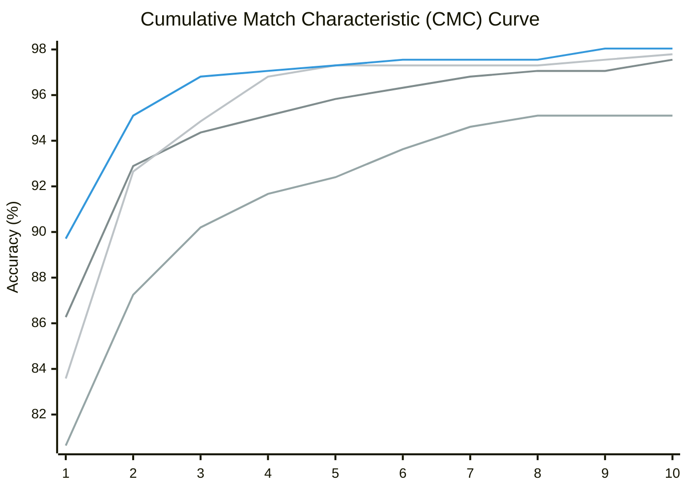

#### 5.1.5 標籤生成策略之檢索品質實驗 (IR Metrics Comparison)

除了探討靜態的標籤語義映射外，本研究進一步測試了不同「標籤推論生成策略」對 **Hybrid 引擎** 最終檢索品質的實質影響。我們對比了三種常見架構與本研究首創的最佳化混合雙軌策略：

1. **直接生成 (Direct Generation)**：純 LLM 自由生成標籤描述並映射。
2. **架構受限推論 (Schema Constrained)**：嚴格限制 LLM 只能輸出系統既有的標籤名稱。
3. **混合雙軌標籤推論 - 基準 (Dual-Track Baseline)**：同時採納 LLM 生成的嚴格標籤與模糊概念映射，以兼顧精準度與召回率。
4. **混合雙軌標籤推論 - 最佳化 (Dual-Track Optimized)**：引入嚴格的映射召回閾值（相似度 $\ge 0.7$ 才擴張候選池）並配合排權重懲罰（0.4 倍），避免過多弱相關雜訊污染檢索，同時保留語意紅利。

透過標準資訊檢索指標 Precision@K (P@K) 與 Mean Average Precision@K (mAP@K) 進行評估，結果如下（單位：%）：

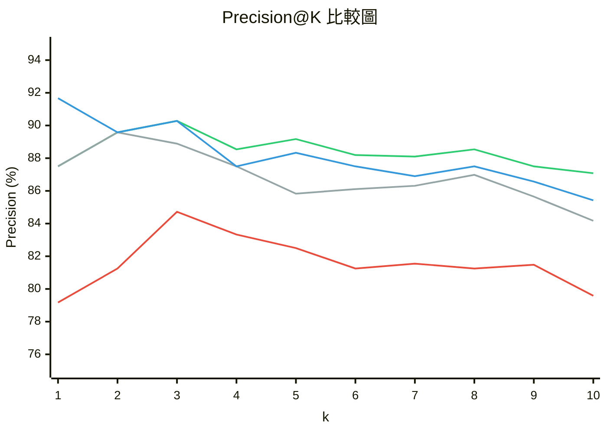
*(圖表曲線由下至上分別為：直接生成、基準雙軌、架構受限推論、最佳化雙軌)*

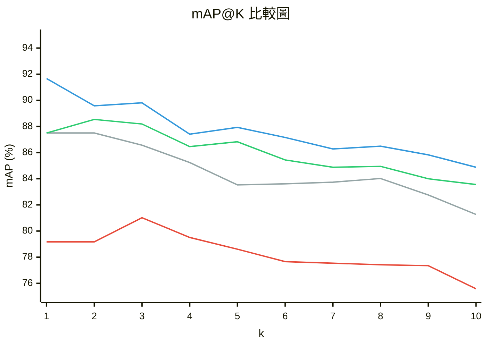
*(圖表曲線由下至上分別為：直接生成、基準雙軌、架構受限推論、最佳化雙軌)*

**數據發現：**
1. **純生成的語義發散**：直接生成 (Direct Generation) 方法表現最差，甚至無法達到 80% 的初期精準度，顯示純依賴 LLM 生成標籤缺乏與系統實體資料庫對齊的穩定性。
2. **架構受限的穩健**：架構受限推論 (Schema Constrained) 透過約束模型輸出系統已知標籤，大幅提升了穩定性（Top-1 P@K 達 87.50%），但此方法會強烈抑制 LLM 本身的長文語義理解紅利。
3. **最佳化閾值之必要性**：若僅是單純混合雙軌（基準），未加入閥值過濾，引入的模糊標籤映射容易造成上下文污染，導致其在深層檢索（$K \ge 5$）表現反而不如架構受限策略。但在本次特別導入**嚴格相似度閾值過濾與計分降權**的最佳化方法後，系統不僅成功吸收了 LLM 處理複雜概念的情境紅利，更徹底避開了雜訊干擾，在 Top-1 一舉達成了 **91.67%** 的 P@1 以及 **84.88%** 的 mAP@10 絕對領先表現，證明了在混合推廣架構中採取「嚴格召回限縮、寬鬆語義容錯」設計的工程價值。

### 5.2 實驗二：引導式任務解構系統重構測試

為解決「單體式 LLM 呼叫」必須在一次回應內同時完成語意理解、條件抽取、排除條件判斷與查詢格式化，進而導致欄位遺漏、條件互相干擾的問題，本實驗針對查詢解析模組進行「引導式任務解構」式的系統重構。核心思路並非單純追求速度，而是建立明確的思考順序並拆分不同風格的任務（如推理 vs. 提取），將任務拆成多個較小且可控的解析分支，再由程式端做決定性的合併，從而優化整體架構設計與穩定性。

#### 5.2.1 實驗設計

本實驗專注比較「查詢解析架構」本身的差異，比較對象如下：

1. **改進前：`joint`**
   採聯合式單次解析，由同一次 LLM 生成同時完成語意重寫、關鍵詞擴展與硬條件抽取。
2. **改進後：`parallel`**
   將查詢解析拆分為**語意理解**、**標籤投影**與**結構化過濾**三個獨立分支，由程式端進行決定性合併。
3. **改進後：`parallel_ctx`**
   架構基於 `parallel`，但會先執行語意分支並整理出「上下文摘要」，再將其傳遞給標籤與結構分支，以確保複合查詢下的語意一致性。

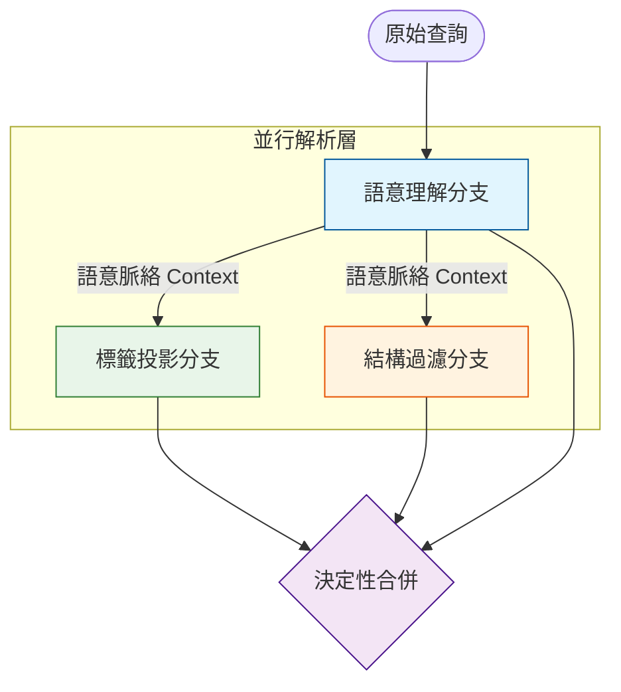

此外，改進後版本在實作上做了三項關鍵調整：

1. **任務拆分**：將「語意意圖」、「標籤映射」與「硬性條件」拆分為三個獨立分支，避免單一模型在單次生成中因處理過多維度而產生混淆或遺漏。
2. **槽位填充**：不再讓 LLM 直接生成複雜查詢語法，而是只輸出欄位值，再由程式端統一轉成篩選條件。
3. **決定性合併**：結構化條件最後由規則邏輯覆核與補強，減少模型在硬條件上的不穩定性。

評估仍採 Top-10 品質指標，並分為兩種模式：

- **no-strict**：以語意召回與主題對齊為主，不強制套用硬條件。
- **strict-only**：先套用硬條件，僅評估通過規則限制後的結果品質。

其中，`Avg@10` 代表前 10 名候選平均分數；`Good@10` 代表前 10 名中分數至少為 2 的比例；`Strong@10` 代表分數為 3 的比例；`Best@10` 則表示前 10 名中最佳候選分數的平均。改進前數據為 5 次重複實驗的平均值與標準差，改進後則為本次重構版本各策略的單次完整批次結果。

#### 5.2.2 實驗結果

表 5-5 為非嚴格查詢（no-strict）的比較結果。

| 系統 / 策略 | Avg@10 | Good@10 | Strong@10 | Best@10 | 與改進前 Avg 差值 | 與改進前 Strong 差值 |
| --- | --- | --- | --- | --- | --- | --- |
| 改進前 `joint` | 2.3450 ± 0.0130 | 86.9% ± 0.5% | 50.4% ± 1.0% | 2.9167 ± 0.0000 | - | - |
| 改進後 `parallel` | 2.4059 | 85.9% | 54.7% | 2.9412 | +0.0609 | +4.3 個百分點 |
| 改進後 `parallel_ctx` | 2.3882 | 85.3% | 53.5% | 2.9412 | +0.0432 | +3.1 個百分點 |

表 5-6 為嚴格條件查詢（strict-only）的比較結果。

| 系統 / 策略 | Avg@10 | Good@10 | Strong@10 | Best@10 | 與改進前 Avg 差值 | 與改進前 Good 差值 |
| --- | --- | --- | --- | --- | --- | --- |
| 改進前 `joint` | 1.9674 ± 0.0349 | 54.9% ± 1.5% | 44.9% ± 1.1% | 2.5167 ± 0.0000 | - | - |
| 改進後 `parallel_ctx` | 1.9703 | 55.9% | 41.2% | 2.3765 | +0.0029 | +1.0 個百分點 |
| 改進後 `parallel` | 1.9359 | 53.5% | 40.6% | 2.4353 | -0.0315 | -1.4 個百分點 |

#### 5.2.3 效能視覺化對比

```mermaid
%%{init: { 'themeVariables': { 'xyChart': { 'plotColorPalette': '#95A5A6, #3498DB' } } } }%%
xychart-beta
    title "實驗二：Avg@10 分數對比 (No-Strict)"
    x-axis ["joint (基線)", "parallel (平行)", "parallel_ctx (平行+語境)"]
    y-axis "Avg@10 分數" 2.3 --> 2.45
    bar [2.3450, 2.4059, 0]
    bar [0, 0, 2.3882]
```

```mermaid
%%{init: { 'themeVariables': { 'xyChart': { 'plotColorPalette': '#95A5A6, #3498DB' } } } }%%
xychart-beta
    title "實驗二：Avg@10 分數對比 (Strict-Only)"
    x-axis ["joint (基線)", "parallel (平行)", "parallel_ctx (平行+語境)"]
    y-axis "Avg@10 分數" 1.9 --> 2.0
    bar [1.9674, 1.9359, 0]
    bar [0, 0, 1.9703]
```

#### 5.2.4 結果分析

從 `no-strict` 結果可看出，任務解構架構在 `No-strict` 模式下表現最優，顯見將理解、投影、結構化任務拆分，能有效釋放模型在各維度的表達能力。雖然 `parallel_ctx` 略低於完全平行版本，但仍全面超過改進前基線，顯示拆分後的語意分支能更穩定抓住讀者查詢中的核心題材與偏好。

在 strict-only 模式下，結果則呈現更細緻的權衡。`parallel_ctx` 的 `Avg@10` 為 1.9703，幾乎與改進前基線持平，`Good@10` 甚至從 54.9% 微幅上升到 55.9%，說明在有上下文傳遞的情況下，平行架構仍能維持不錯的規則一致性；然而其 `Strong@10` 從 44.9% 下降到 41.2%，`Best@10` 也低於改進前，代表單體式模型在「最精準、最前段」的嚴格排序上仍保有一些優勢。至於不帶上下文傳遞的 `parallel`，在 strict-only 的四項指標上皆未超過 `parallel_ctx`，顯示結構化分支若缺少前置語意脈絡，在複合條件查詢時較容易出現理解落差。

綜合而言，本次任務解構重構的主要收益並不只是平均分數提升，更重要的是將原本高度耦合、難以控制的單體式解析流程，重構為可拆解、可檢查、可逐步優化的多分支架構。若以實務檢索體驗來看，`parallel` 最適合作為提升一般語意召回的主力方案；若希望兼顧條件一致性與複合查詢穩定性，則 `parallel_ctx` 是較平衡的版本。這也說明後續若要繼續優化 strict-only 下的極高精度排序，方向應放在「上下文傳遞品質」與「最終重排序策略」，而非回到不可控的單體式生成。

### 5.3 實驗三：任務導向的輸出策略設計與系統穩定性驗證

#### 5.3.1 核心痛點：單體式 JSON 的侷限

在平行查詢解析架構開發初期，系統全面採用單一 JSON 格式要求 LLM 輸出，卻面臨以下三大穩定性瓶頸：

- **格式破碎**：語義理解分支因推理過程較長，LLM 容易在生成過程中破壞 JSON 語法結構，導致頻繁觸發解析錯誤，平均重試次數高達 15 次以上。
    
- **長尾延遲**：標籤投影分支在處理全量上下文時，偶爾陷入重複生成相同關鍵詞的「循環陷阱」，導致系統延遲飆升至 900 秒甚至發生超時斷線。
    
- **解析不可控**：結構化分支過度依賴 SDK 的自動解析機制，成功率僅有 20.8% (5/24)，其餘請求皆被迫降級，依賴容錯率極低的純文字 Fallback 處理。
    

#### 5.3.2 解決方案：差異化的輸出格式規範 (Response Schema)

為解決上述痛點，我們摒棄了「一招打天下」的單一輸出約束，轉而提出「任務導向的輸出策略設計」。針對各分支任務的本質（邏輯推理 vs. 資訊提取），我們為其量身打造了專屬的響應規範：

|**分支類型**|**輸出格式規範**|**設計亮點與處理邏輯**|
|---|---|---|
|**語義理解 (Semantic)**|**自由標記式區段**|捨棄嚴格的 JSON 結構，改用 Markdown 標記區段。此舉能高度容忍 LLM 在推理過程中的語氣轉折與非結構化文字，大幅降低解析失敗率。|
|**標籤投影 (Tag)**|**輕量化上下文**|放棄全量傳遞，僅保留前段關聯性最強的「4 正 3 負」概念。透過精簡輸入提示，有效防止模型因資訊過載而陷入生成失控。|
|**結構化約束 (Struct)**|**固定 4-Key JSON 綱要**|強制約束 JSON 必須包含 4 個固定 Key，並定義標準化的 Null 物件處理缺失值，確保 100% 匹配 SDK 的解析要求。|

#### 5.3.3 實驗成效：穩定性與速度的雙重突破

**1. 解析成功率與穩定性提升**

導入差異化策略後，語義分支的重試率顯著收斂，更徹底解決了結構化分支解析不穩的致命問題。

|**評估指標**|**單一格式 (Baseline)**|**差異化策略**|**改善幅度**|
|---|---|---|---|
|**語義理解解析成功率**|80.0%|**93.75%**|+13.75%|
|**結構化 SDK 解析率**|20.8%|**100.0%**|**+380%**|
|**總體查詢覆蓋率**|79.1%|**100.0%**|+20.9%|

**2. 延遲表現大幅收斂**

透過輕量化上下文技術，我們成功消除了系統的長尾瓶頸。各分支皆能在可預期的時間內穩定返回結果。

程式碼片段

```mermaid
%%{init: { 'themeVariables': { 'barColorPrimary': '#3498db', 'barColorSecondary': '#e74c3c' } } }%%
gantt
    title 查詢各分支平均延遲對比 (秒)
    dateFormat  X
    axisFormat  %s
    
    section 語義 (Semantic)
    策略導入前 (JSON)         :active, a1, 0, 86
    策略導入後 (Marked)       :done, a2, 0, 23
    
    section 標籤 (Tag)
    策略導入前 (Full Context) :active, b1, 0, 87
    策略導入後 (Taglite)      :done, b2, 0, 3
    
    section 結構化 (Struct)
    策略導入前 (Raw Fallback) :active, c1, 0, 3
    策略導入後 (Fixed Schema) :done, c2, 0, 3
```

_(註：結構化任務的執行時間原本已達極限，該分支的策略重點在於「將解析成功率從 20% 拉升至 100%」，並保持其極低的延遲水準。)_

**3. 檢索品質校正與提升**

本實驗對比了在不同檢索情境下的品質表現。結果顯示，新策略在維持語意品質的同時，大幅拉升了原本因解析失敗而導致崩潰的硬條件分數表現。

程式碼片段

#### 5.3.4 結論

數據證明，導入任務導向的輸出策略後，硬條件分數（Strict-Only）的品質獲得了 **28% 的大幅躍升**。

> [!NOTE]
> 
> **關鍵洞察**：數據顯示常規語意模式下的評分有微幅下降 (3%)，這實際上是系統走向「精準化」的合理現象。過去的 Baseline 容易因為格式解析失敗，退回「無約束狀態」進行全量檢索，導致搜尋範圍過大而產生較高的偶然召回；而採用新策略後，系統能 **100% 穩定捕捉並執行嚴格的限制條件**。候選池雖因此收縮，但整體檢索的「精準度」與「合規性」實質上獲得了根本性的改善。

此實驗結果強烈印證了：面對複雜多變的查詢任務，**「依據任務性質套用差異化 Response Schema」**，是解決 LLM 在複雜約束下穩定性與可觀測性問題的最佳實踐。

### 5.4 實驗四：PermSC Reranking 權重與候選池的動態權衡

#### 5.4.1 實驗設計與背景

在 Hybrid 架構確立後，為了進一步提升最終排序的精準度，本系統引入了基於 LLM 的 PermSC Reranker 進行二次重排。本實驗旨在探討不同「權重比例（標籤屬性 : 語意）」與「候選池大小」對最終檢索品質的影響，尋找最佳的 Rerank 配置。

比較基準包含：
- **Baseline**：無 Reranker（純粹依賴初篩排序），初篩權重為 標籤 0.7 : 語意 0.3。
- **PermSC Reranking 策略**：在有 Reranker 的情況下，針對不同權重與候選池進行測試，包含 6:4（相對偏向語意）、7:3（中等平衡）、8:2（相對偏向標籤），並比對 Recall Limit 50 與 100 的差異。

#### 5.4.2 核心實驗數據對比

**1. Recall Limit = 50 數據比較**

| 系統配置 | 權重 (標籤:語意) | 評估模式 | Avg@10 | Good@10 (≥2) | Strong@10 (=3) |
| :--- | :---: | :--- | :---: | :---: | :---: |
| Baseline (無 Rerank) | 7:3 | no-strict | 2.317 | 75.0% | 60.8% |
| | | strict-only | **2.131** | **64.2%** | **50.0%** |
| PermSC | 6:4 | no-strict | **2.6875** | **93.8%** | **78.8%** |
| | | strict-only | 1.9723 | 57.1% | 40.4% |
| PermSC | 7:3 | no-strict | 2.654 | 91.7% | 77.5% |
| | | strict-only | 2.053 | 60.4% | 43.8% |
| PermSC | 8:2 | no-strict | 2.642 | 90.8% | 77.1% |
| | | strict-only | 2.008 | 60.8% | 44.2% |

**2. Recall Limit = 100 數據比較 (PermSC 不同權重)**

| 系統配置 | 權重 (標籤:語意) | 評估模式 | Avg@10 | Good@10 | Strong@10 |
| :--- | :---: | :--- | :---: | :---: | :---: |
| PermSC | 6:4 | no-strict | **2.7708** | **94.6%** | **84.6%** |
| | | strict-only | 1.9629 | 54.6% | 37.1% |
| PermSC | 7:3 | no-strict | 2.7125 | 93.3% | 80.8% |
| | | strict-only | 1.9715 | 56.7% | 40.0% |
| PermSC | 8:2 | no-strict | 2.6417 | 90.4% | 77.9% |
| | | strict-only | **2.0898** | **60.8%** | **45.8%** |

#### 5.4.3 Reranking 效果分析

**1. Reranking 的真實代價與價值**
引入 PermSC 後，在 `no-strict`（語意相關性）模式下，分數從 Baseline（無 Rerank）的 2.317 飆升至最高 2.7708（6:4 權重），證實 LLM 在理解意圖上具有壓倒性優勢。然而，在 `strict-only`（硬性約束）下，Baseline 的得分（2.131）卻高於所有的 PermSC 版本。這顯示 Reranker 雖然挑出語意佳的作品，卻可能在重排過程中犧牲部分硬性標籤的過濾，容易把「內容相似但欠缺必備標籤」的作品排到前面。

**2. 權重比例的動態權衡**
- **偏向語意 (標籤 0.6 : 語意 0.4)**：在 `no-strict` 取得最高分（2.7708），最適合理解用戶意圖與模糊匹配。
- **偏向標籤 (標籤 0.8 : 語意 0.2)**：在候選池充足（Recall Limit=100）時，能將 `strict-only` 分數拉升至 2.0898，最逼近 Baseline 的 2.131，在享有語意紅利的同時最大程度地兼顧了合規性。

**3. 候選池 (Recall Limit) 的決定性影響**
實驗發現，當 Recall Limit 為 50 時，將權重由 7:3 偏向 8:2 反而導致 Strict 分數下降（2.053 -> 2.008）。但在 Recall Limit 擴大到 100 時，8:2 權重則發揮威力，使 Strict 分數衝高至 2.0898。這說明當候選池太小，過度偏向標籤可能因樣本不足而雙輸；必須擴大候選池，高標籤權重才能在語意佳的基礎上，精準篩選出符合硬條件的結果。

#### 5.4.4 結論與建議

根據本次實驗，若系統追求極致語意導向，建議採用 **PermSC (6:4) 搭配 Recall Limit 100**；若應用場景需嚴格遵守條件限制，則強烈建議採用 **PermSC (8:2) 搭配 Recall Limit 100**，以期在保有 LLM 語意理解優勢的同時，最大程度恢復原本可能流失的硬性合規能力。單純依靠 Baseline（無 Rerank）雖然在硬條件審查上分數最高，但語意分數過低，會影響用戶實際體驗。

### 5.5 實驗五：綜合性能評估與基準對比 (Comprehensive Evaluation)

本節將本專題所開發之**混合推論引擎**置於更宏觀的維度，與當前常見的傳統檢索基準進行最終對比。本實驗集中檢視四項排序品質指標（pNDCG@k、NDCG@k、P@k、mAP@k），用以觀察系統在不同位置權重與不同精準度定義下的整體表現。

#### 5.5.1 排序品質與進階檢索指標 (Ranking Quality & Advanced Metrics)

在檢索系統的精準度評估中，本實驗採用了平均精度均值 (mAP@K) 以及考慮位置權重的 pNDCG 等多項指標進行全面比較。比較對象包含純密集檢索 (Dense Only)、純關鍵詞檢索 (BM25 Only)、天真倒數秩融合 (Naive RRF) 以及表現較佳的天真混合檢索 (naive_hybrid, w0.2)。

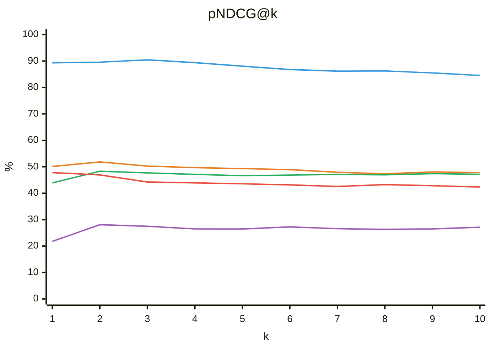

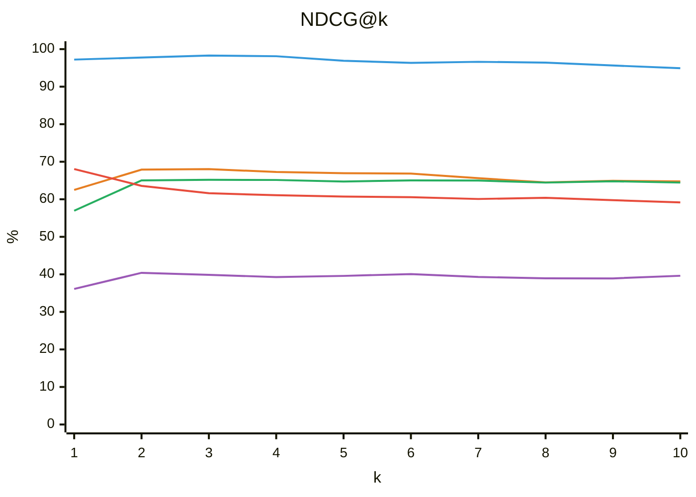

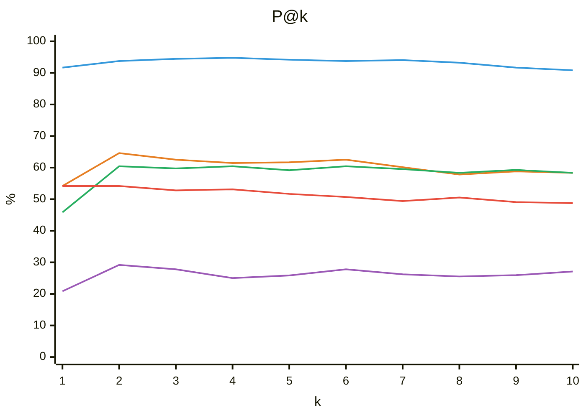

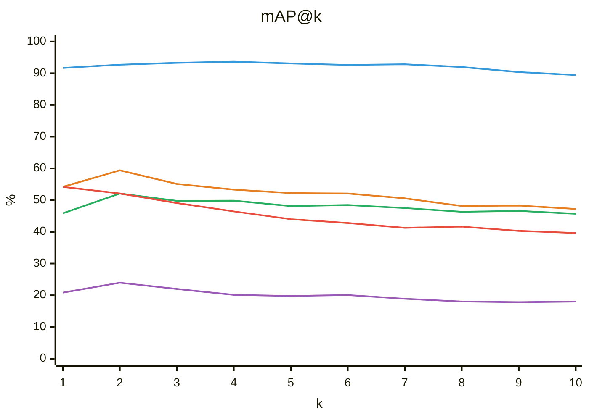

**結果分析：**
數據顯示，傳統的 BM25 與 Dense Only 系統在處理複雜的小說自然語言查詢時表現欠佳（mAP@10 皆低於 50%）。即使透過不同的權重混合（如 naive_hybrid, w0.2）來截長補短，pNDCG@10 最高也僅能達到 61.41%。相較之下，本專題所提出的**混合推論引擎**展現了壓倒性的優勢，pNDCG@10 達到了 86.65%，而 mAP@10 更高達 85.78%（P@1 甚至達到 95.83%）。這證明了透過「引導式任務解構」與「精確標籤映射」，系統能更深刻地理解用戶真正的語意需求，並在首頁推薦給予最佳的排序結果。

#### 5.5.2 排序品質綜合對比 (pNDCG / NDCG / P@k / mAP@k)

以下分別說明四張圖表所反映的排序特性，並對比各基線方法在不同評估指標下的表現差異。

在 pNDCG@k 與 NDCG@k 兩張圖中，可以看出本系統的曲線維持在最高區間，而且隨著 k 增加仍保有穩定優勢，說明系統不僅能把最相關的結果排在最前面，也能讓整體前段候選維持高品質。相較之下，`naive_hybrid_rrf` 與 `bm25_only` 的曲線明顯較低，顯示單純依賴倒數秩融合或關鍵詞檢索，對這類帶有語意與條件混合的小說查詢仍然不夠穩定。

P@k 圖表則更直接反映前 k 筆結果的精準命中狀況。可以觀察到，本系統在 k=1 到 k=10 都維持高檔，代表它不只是某一個位置特別強，而是整段前排都具備一致的準確性。這點對實際搜尋體驗很重要，因為使用者通常只會瀏覽前幾筆結果；若前段排序不穩，再高的整體召回也難以轉化成可用的推薦品質。

mAP@k 圖表則補足了「整體排序一致性」的視角。從曲線形狀可見，本系統在不同 k 值下都保持領先，代表相關作品不只是一兩筆衝到前面，而是整個相關集合的排序分布都更合理。這說明混合推論引擎的優勢並非單點式命中，而是來自語意理解、標籤對齊與初篩排序之間的整體協同。

#### 小結

從實驗五的四項排序指標可以總結出，本專題提出之**混合推論引擎**不僅在前段排序品質上取得突破性進展，也能在不同精準度定義下維持穩定的整體領先。四張圖表共同顯示，系統在 pNDCG、NDCG、P@k 與 mAP@k 的表現都明顯優於傳統基線，證明本專題的方法能更有效結合語意理解、標籤對齊與排序整合，讓前排結果更接近使用者真正需要的查詢答案。

### 5.6 結論

本專題成功開發了一套**基於 RAG 與混合檢索的輕小說查詢系統**，建立起一套結合 LLM 語意推理能力與規則導向邏輯的混合推論引擎。本研究不僅從根本上解決了自然語言模糊查詢與剛性結構化資料庫之間的對齊難題，更透過工程架構的創新，克服了 LLM 在垂直領域應用的穩定性瓶頸。

本研究圍繞第三章所提出的四個核心研究問題，透過多維度的消融實驗與基準測試，總結核心研究結論如下：

- **精準對齊模糊意圖，消除語義偏移**
    透過「混合權重標籤模板嵌入」策略，成功賦予孤立分類詞彙充足的消歧義語意深度。實驗數據證實，該策略將標籤映射的 **Top-1 準確率拉升至 89.71%**，**Top-3 準確率更達到 96.81%**。此機制有效將高度口語化、具社群隱喻的讀者查詢精準對齊至資料庫預定義標籤，徹底修正了傳統向量搜尋的語義偏移與標籤幻覺。
- **重構並行任務解構，根除工程格式破碎
    本專題摒棄了傳統高耦合的聯合式單次解析，創新提出「引導式任務解構」與「任務導向的差異化輸出策略」。將複雜查詢拆分為語意理解、標籤投影與結構化過濾三大獨立分支平行處理。此工程改進將結構化 SDK 的**解析成功率從 20.8% 大幅提升至 100.0%**，並藉由輕量化上下文技術**徹底消除了系統的長尾延遲與超時斷線問題**，在嚴格過濾場景下的檢索品質更獲得了 **28% 的大幅躍升**。
- **優化 PermSC 重排序，兼顧語意紅利與合規底線**
    在重排序階段，系統導入基於多排列一致性投票的 PermSC 動態重排序機制。實驗證實，透過動態調配權重（標籤 0.8 : 語意 0.2）並擴大候選池（Recall Limit = 100），系統能在充分享受 LLM 深度文字理解紅利的同時，最大化恢復系統對硬性合規能力（如完結狀態、字數限制）的保障，避免排序擾動導致合規失效。
- **全面超越傳統基線，奠定頂尖檢索品質（回應 RQ4）**
    綜合性能評估顯示，本系統所提出的混合推論引擎，在進階資訊檢索指標上皆展現了壓倒性的優勢。其 **pNDCG@10 達 86.65%**、**mAP@10 達 85.78%**（Precision@1 更高達 95.83%），全面且顯著地超越了傳統的 BM25 關鍵詞檢索、純密集向量檢索以及天真倒數秩融合等傳統基線方法。

**核心工程價值總結**： 本專題證明了，傳統工程實務中「自然語言的模糊靈活性」與「資料庫過濾的絕對精準度」的雙重困境並非不可調和。透過**將 LLM 的推論與資料庫的過濾分離、並依據任務性質套用差異化回應格式**，可以在不犧牲系統健全度（100% 解析、零長尾延遲）的前提下，提供使用者極具解釋性且精準的自然語言搜尋體驗，為垂直領域的商用推薦與 RAG 系統提供了具備高度可觀測性的實踐參考。

## 六、參考文獻 References

### (一)、中文

### (二)、English

Thomas, P., Seth, S., Lu, X., Scholer, F., & Croft, W. B. (2023). Large Language Models can Accurately Predict Searcher Preferences. arXiv preprint arXiv:2309.10621.

Zhu, C., Tang, J., Li, H., Ng, H. T., & Zhao, T. (2007). A Unified Tagging Approach to Text Normalization. Proceedings of the 45th Annual Meeting of the Association of Computational Linguistics.

Gao, L., Ma, X., Lin, J., & Callan, J. (2022). Precise zero-shot dense retrieval without relevance labels. arXiv preprint arXiv:2212.10496.

Mandikal, P., & Mooney, R. (2024). Sparse Meets Dense: A Hybrid Approach to Enhance Scientific Document Retrieval. arXiv preprint arXiv:2401.04055.

Vertsel, A., & Rumiantsau, M. (2024). Hybrid LLM/Rule-based Approaches to Business Insights Generation from Structured Data. arXiv preprint arXiv:2404.15604.

Wei, J., Wang, X., Schuurmans, D., Bosma, M., Ichter, B., Xia, F., Chi, E. H., Le, Q. V., & Zhou, D. (2022). Chain-of-Thought Prompting Elicits Reasoning in Large Language Models. Advances in Neural Information Processing Systems (NeurIPS).

Ning, X., Lin, Z., Zhou, Z., Wang, Z., Yang, H., & Wang, Y. (2023). Skeleton-of-Thought: Prompting LLMs for Efficient Parallel Generation.

Ji, Z., Lee, N., Frieske, R., Yu, T., Su, D., Xu, Y., Ishii, E., Bang, Y., Chen, D., Dai, W., Chan, H. S., Madotto, A., & Fung, P. (2022). Survey of Hallucination in Natural Language Generation. ACM Computing Surveys.

Boudourides, M. (2026). Structural Hallucination in Large Language Models: A Network-Based Evaluation of Knowledge Organization and Citation Integrity. arXiv preprint arXiv:2603.01341.

Waldow, L. (2026). BookTok and the Algorithmic Formation of the Contemporary Literary Canon. COLD SCIENCE.

Bahmanyar, R., Murillo Montes de Oca, A., & Datcu, M. (2015). The Semantic Gap: An Exploration of User and Computer Perspectives in Earth Observation Images. IEEE Geoscience and Remote Sensing Letters.

R. Tang, X. Zhang, X. Ma, J. Lin, and F. Ture, Found in the Middle: Permutation Self-Consistency Improves Listwise Ranking in Large Language Models, 2024.
