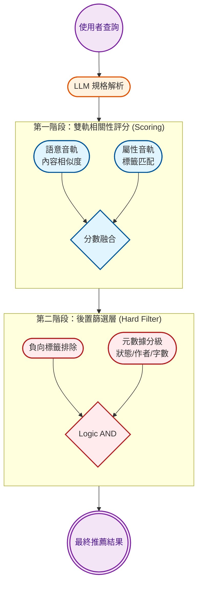

# 畢業專題：專題報告（下學期）

## 第一章：緒論 (Introduction)

### 1.1 研究背景

在網路文學產值逐年增長的背景下...

（描述網路小說市場的龐大，以及現行搜尋方式（標籤勾選）的普及）

### 1.2 研究動機

傳統檢索介面過於僵硬、新興的 AI 搜尋缺乏穩定性

### 1.3 問題定義

雖然自然語言處理技術（LLM）已大幅進步，但在網路小說推薦領域，現有系統仍多依賴手動勾選標籤的結構化檢索。

本專題在開發「自然語言小說搜尋工具」時發現，將使用者的模糊意圖轉換為資料庫標籤時存在語義偏移與標籤幻覺問題。若直接採用 LLM 輸出，常會導致搜尋結果因標籤不匹配而失效；若僅採用規則，則無法處理口語化的查詢。

因此，本研究定義的問題為：「如何建立一套穩定的映射機制，將 LLM 提取的語義意圖精確對齊至預定義的結構化標籤集，以實現穩定且具備領域知識的小說檢索系統。」

### 1.4 研究目標

本研究旨在開發一套結合大型語言模型（LLM）與規則導向（Rule-based）邏輯的混合式網路小說檢索引擎，解決自然語言查詢與結構化標籤集之間的語義對齊問題，提供穩定、精準且具備解釋性的檢索體驗。

## 第二章：文獻探討與相關技術 (Related Work)

### 2.1 混合架構與降低標籤幻覺 (Hybrid Architecture)

- **痛點**：單純依賴 LLM 處理精確資料易產生「幻覺」。
- **文獻支持**：Vertsel 等人 (2024) 證實，將 LLM 與規則基礎（Rule-based）系統結合，例如透過規則進行名稱雜湊與還原，能將專有名詞的幻覺錯誤率從 12% 壓低至 3%。這強力支持本研究「**LLM 負責語義理解，規則機制負責標籤精確對齊**」的系統架構。

> Vertsel, A., & Rumiantsau, M. (2024). Hybrid LLM/Rule-based Approaches to Business Insights Generation from Structured Data

### 2.2 查詢擴展與假設性文件嵌入 (Query Expansion & HyDE)

- **痛點**：口語化查詢太短，與資料庫既有標籤存在語意鴻溝。
- **文獻支持**：
  - Jagerman 等人 (2023) 發現，利用 LLM 的思維鏈（CoT）提示詞進行查詢擴展，能自動生成大量相關關鍵字，顯著提升檢索召回率。
  - Gao 等人 (2022) 提出 HyDE 技術，在零樣本情況下，先讓 LLM 根據模糊查詢生成一篇「假設性文件」，再將其轉為向量去檢索真實文件，有效過濾錯誤細節並捕捉深層語境。

> Jagerman, R., Zhuang, H., Qin, Z., Wang, X., & Bendersky, M. (2023). Query Expansion by Prompting Large Language Models
> Gao, L., Ma, X., Lin, J., & Callan, J. (2022). Precise Zero-Shot Dense Retrieval without Relevance Labels

### 2.3 本體論與混合檢索 (Ontology & Hybrid Retrieval)

- **痛點**：純向量語意檢索容易錯失使用者明確指定的專有名詞標籤。
- **文獻支持**：
  - Mandikal 與 Mooney (2024) 實驗證明，結合傳統稀疏向量（如 BM25）與密集向量（如 SPECTER2）的**混合檢索**，其效能與準確度顯著超越單一檢索方法。
  - Ballapuram (2024) 的 OA-RAG 系統同樣採用混合檢索（BM25 佔 80% 權重，語意佔 20%），並透過建立領域「本體論 (Ontology)」知識圖譜來約束檢索結果，確保資料對齊的邏輯一致性。

> Mandikal, P., & Mooney, R. (2024). Sparse Meets Dense: A Hybrid Approach to Enhance Scientific Document Retrieval
> Gao, Y., Sheng, T., Xiang, Y., Xiong, Y., Wang, H., & Zhang, J. (2023). Chat-REC: Towards Interactive and Explainable LLMs-Augmented Recommender System

### 2.4 LLM 二次重排與解釋性推薦 (LLM Re-ranking)

- **痛點**：純演算法算分可能導致最終推薦的小說整體氛圍不符。
- **文獻支持**：Gao 等人 (2023) 提出 Chat-REC 框架，將傳統檢索系統篩選出的「初步候選集」作為提示詞輸入 LLM，讓 LLM 進行最後的二次過濾與重排（Re-ranking）。此舉不僅提升了推薦精準度，還能自動生成具解釋性的推薦理由，增強系統互動性。

> Gao, Y., Sheng, T., Xiang, Y., Xiong, Y., Wang, H., & Zhang, J. (2023). Chat-REC: Towards Interactive and Explainable LLMs-Augmented Recommender System

## 第三章：系統設計與架構 (System Design)

這章要放大量的圖表，展示你的「黑科技」。

### 3.1 系統總體架構

### 3.2 語義映射模組設計

1. 預先建立映射表：在搜尋前段，將使用者查詢萃取出的「目標標籤」透過向量資料庫比對，轉換為針對系統內既有標籤的語意相似度權重表（映射清單）。
2. 獨立屬性面向評估：將每個目標標籤視為獨立面向，比對每本書自帶的標籤。找出單一書本標籤中最符合各目標面向的最高相似度（MaxSim）分數。
3. 取向加總避免稀釋：將所有面向的最高分取平均，做為該書最終的屬性分數。此作法確保只要有單一強烈契合的標籤，便能獲得高分，不易被書籍過多的無關標籤稀釋權重。
4. 負向標籤語意攔截：若使用者指定排除某些概念，系統同樣會針對該詞彙進行語意檢索，自動列出所有相關的系統標籤進行後置過濾攔截。

### 3.3 結構化資料過濾邏輯

1. 評分與篩選分離：先進行語意與標籤評分排序，再由後置過濾層強制移除不合規項目。
2. 硬性篩選指標（不符則直接剔除）：
    - 負向標籤：含括任意排除關鍵字即移除。
    - 完結狀態：與指定狀態（完結/連載）不符即移除。
    - 指定作者：作者名稱未包含搜尋關鍵字即移除。
    - 字數範圍：超出設定區間即移除。
3. 資料召回深度：為確保篩選後仍有足夠候選，初次召回深度設為 10,000 筆。

### 3.4 黑盒子解釋機制

1. 誠實核對：LLM 擔任誠實顧問，若書籍僅因關鍵字湊合但內容不符（如僅書名命中），須主動指出系統可能誤判，嚴禁發明情節。
2. 證據引用：將結構化的評分指標（如語意相似度、標籤匹配項）轉譯為自然語言，說明系統挑選此書的具體證據。
3. 語意比對：基於檢索命中的內文片段與書籍簡介，精確核對使用者核心需求，並根據契合程度動態調整推薦語氣。

## 第四章：實作與實驗結果

用數據說話，證明你的東西真的有用。

### 4.1 實作環境與工具：使用什麼語言（Python/FastAPI）、什麼資料庫、多少筆小說資料。

### 4.2 案例分析：挑選 3-5 個經典例子，對比「純 LLM」與「你的系統」在標籤提取上的精確度。

### 4.3 使用者體驗/效能評估：對比傳統勾選與你的自然語言搜尋在時間、直覺性上的表現。

## 第五章：結論與未來展望

### 5.1 研究貢獻：總結你解決了標籤對齊問題，並實現了穩定的混合檢索。

### 5.2 系統限制：誠實面對問題（如：目前僅參考簡介與標籤，尚未深入全文）。

### 5.3 未來工作：例如引入全文語義分析、開發更直觀的 UI 介面。
