# 基於 RAG 與混合檢索的輕小說查詢系統

## 計畫中文摘要

隨著網路文學產值的逐年增長，小說市場變得極為龐大，然而現有依賴手動勾選標籤的結構化檢索系統過於僵硬，無法滿足使用者口語化的搜尋需求。另一方面，直接導入大型語言模型（LLM）的搜尋系統則常出現「語義偏移」與「標籤幻覺」，導致搜尋失效或不穩定。為解決此痛點，本專題開發了一套結合 LLM 與規則導向（Rule-based）邏輯的混合式網路小說檢索引擎，透過「語意映射模組」與「結構化過濾邏輯」，輔以 Skeleton-of-Thought (SoT) 的平行查詢解析技術，將使用者的模糊意圖精確且穩定地對齊至系統預定義的標籤集。實驗成果顯示，本系統能顯著提升非嚴格查詢的語意檢索能力，同時確保結構化條件的穩定攔截，提升了系統的檢索穩定性與語意對齊精度。

## 一、前言

### 研究動機

在網路文學產值逐年增長的背景下，網路小說（特別是輕小說）的數量與市場規模變得極為龐大。然而，輕小說特有的語境（例如「轉生」、「傲嬌」、極長且敘述性的標題）使得傳統依賴手動勾選標籤的檢索介面顯得過於僵硬，無法應對這類高度口語化、充滿特定梗或模糊的查詢需求。此外，雖然近年興起了導入 AI 技術的搜尋工具，但這些新興搜尋系統在解析使用者意圖時往往缺乏穩定性。

### 相關研究

#### 傳統結構化檢索系統對比

現有的網路小說推薦領域大多仰賴結構化的檢索方式（如手動勾選分類與標籤）。這類系統的優勢在於搜尋結果絕對精確且不會超出規則邊界，但缺點是其檢索介面過於僵硬，完全無法處理包含情緒、複雜情境或是長句型的自然語言查詢。

#### 既有純大型語言模型（LLM）檢索的侷限

雖然自然語言處理技術已大幅進步，但直接讓 LLM 生成搜尋語法（DSL）或標籤，極易產生「標籤幻覺」（生成系統資料庫中不存在的標籤）或是「語義偏移」（字面意義接近但實質分類不同）的問題。同時，在單次 LLM 查詢中同時處理語意理解、擴展關鍵詞與硬條件抽取，常會導致模型無法兼顧所有條件，進而忽略部分篩選規則。

## 二、研究目的

### 研究目的

本專題在開發「自然語言小說搜尋工具」的過程中觀察到，將使用者的模糊意圖轉換為資料庫標籤時，若直接採用 LLM 的輸出，常導致「語義偏移」與「標籤幻覺」，造成標籤不匹配而使搜尋失效；若僅採用固定規則，又無法處理口語化的查詢。因此，本研究的核心目的為：「建立一套穩定的映射機制，將 LLM 提取的語義意圖精確對齊至預定義的結構化標籤集」。

### 預期成果

本專題預期完成一套結合大型語言模型（LLM）與規則導向（Rule-based）邏輯的混合式網路小說檢索引擎，從根本解決自然語言查詢與結構化標籤集之間的語義對齊問題，最終提供使用者一個穩定、精準且具備解釋性的小說檢索體驗。

## 三、研究方法與成果

### 3.1 書籍資料處理與索引建置

在檢索系統運作前，需先針對原始書籍資料進行標準化與特徵提取，以建立後續檢索所需的向量資料庫（VS）與屬性資料庫（DB）。

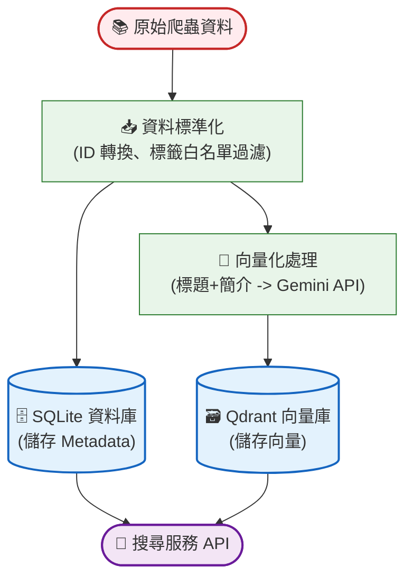

- **資料標準化與過濾**：讀取爬蟲資料，進行 ID 轉換（UUID5）並透過標籤白名單進行過濾。
- **雙軌索引建置**：將書籍元數據寫入 SQLite 以供結構化過濾；同時將「標題+簡介」透過 Gemini API 向量化後存入 Qdrant，作為語意檢索的基礎。

### 3.2 系統架構與檢索流程

本系統採用混合式架構，將「模糊語意理解」與「結構化過濾」分離處理。

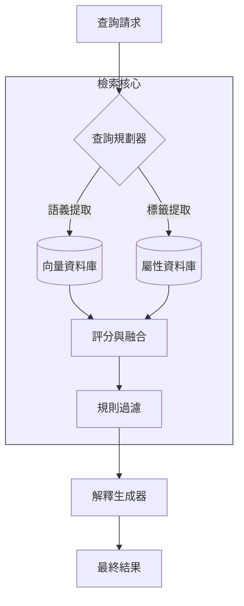

### 3.3 語義映射模組設計

1. **預先建立映射表**：在搜尋流程前段，系統會將使用者查詢中所萃取出的「目標標籤」，透過向量資料庫比對，轉換為針對系統內既有標籤的語意相似度權重表。
2. **MaxSim 語意映射**：透過 **MaxSim (Maximum Similarity)** 機制，針對各目標面向選取最高分標籤，計算所有面向最高分的平均值作為該書籍的最終屬性分數，避免書籍因標籤過多而導致語意稀釋。
3. **負向標籤語意攔截**：當使用者指定排除某些概念時，系統會自動針對該詞彙進行語意檢索，並列出所有相關的系統標籤進行後置過濾。

### 3.4 結構化資料過濾邏輯

系統的篩選邏輯採用「評分與篩選分離」機制，先透過前述步驟進行語意排序，再由後置過濾層強制剔除不合規項目。

- **硬性篩選指標**：包括負向標籤排除、完結狀態匹配、指定作者名稱比對以及字數範圍限制，只要上述任一條件不符即直接剔除。
- **資料召回深度**：為了避免硬條件篩選後無候選書籍，初次的資料召回深度設定為 10,000 筆，以平衡處理效能與篩選覆蓋率。

## 四、結果及討論

為驗證並最佳化本專題之系統效能，本研究進行了多項核心實驗：

### 4.1 實驗一：標籤模板嵌入 (Tag Template Embedding) 模型與語境比較

#### 4.1.1 實驗背景與目的

本專題之檢索引擎採用「兩階段標籤映射」策略：先由大型語言模型（LLM）生成描述性標籤，再透過 Embedding 向量模型將其映射至資料庫中真實存在的標籤。然而，單純的標籤詞彙在向量空間中常因缺乏語境而導致語義模糊（例如「JK」可能被視為隨機字母而非「女高中生」類型）。本實驗旨在測試不同模板對標籤映射準確度的影響，找出最佳的語意引導方式。

#### 4.1.2 實驗設定

- 模型與參數：採用 `gemini-embedding-001` 模型，限制候選集為系統核心之 60 個標籤。
- 方法論：
    1. **對稱式模板策略 (Symmetric)**：在預處理端與查詢端套用相同語境（`這部作品的類型偏向{label}`）。
    2. **混合權重語義強化 (Strategy C)**：將「標籤名稱模板」與「標籤詳細說明」兩組 Embedding 進行加權融合。計算方式如下：

    $$\text{Score} = w_s \cdot S_{\text{sym}} + w_d \cdot S_{\text{desc}}$$

    (其中 $w_s = 0.7, w_d = 0.3$)
- 評測指標：針對 408 組模擬查詢，計算其 Top-1、Top-3（系統預設召回數）及 Top-5 之累積準確率（CMC），並額外觀察在多標籤召回（K=3）下的過濾穩定性。
  
#### 4.1.3 實驗結果與數據分析

實驗對比了原始標籤（Raw Label）、對稱模板（Symmetric）以及引入說明文字的混合策略（Hybrid Weight）。下表列出其累積準確率之對比：

| 指標 (K 值) | raw_label (基準) | Symmetric (對稱模板) | **Hybrid Strategy (語義強化)** |
| :--- | :--- | :--- | :--- |
| **Top-1 Accuracy** | 78.19% | 83.33% | **88.48%** |
| **Top-3 Accuracy** | 89.22% | 93.63% | **95.83%** |
| **Top-5 Accuracy** | 91.67% | 95.83% | **96.81%** |

#### 4.1.4 討論與發現

*   **語意激活與偏移修正**：透過詳細相似度分析發現，模板能顯著提高正確標籤的絕對相似度，並有效解決俚語映射問題（如將「戴綠帽」精準映射至「NTR」標籤）。
*   **消歧義效果與區分度**：加入標籤說明文字（Strategy C）後，系統能有效區分語義接近的標籤（如「青春」與「青春日常」）。說明文字提供了額外的特徵（如：是否包含校園瑣事），幫助模型在極其接近的候選者中做出正確判斷，正確項能保持 0.05 以上的穩定領先距離。
*   **多標籤召回的穩定性**：實驗發現，單純對稱模板在 `max_tags_per_term=3` 時，容易因引入弱相關標籤而稀釋正確標籤的影響力。語義強化策略透過深度理解，顯著提升了在「嚴格過濾（Strict-Only）」場景下的穩定性（Strong@10 提升約 6.7%），這為系統預設開啟多標籤映射提供了強而有力的數據支撐。

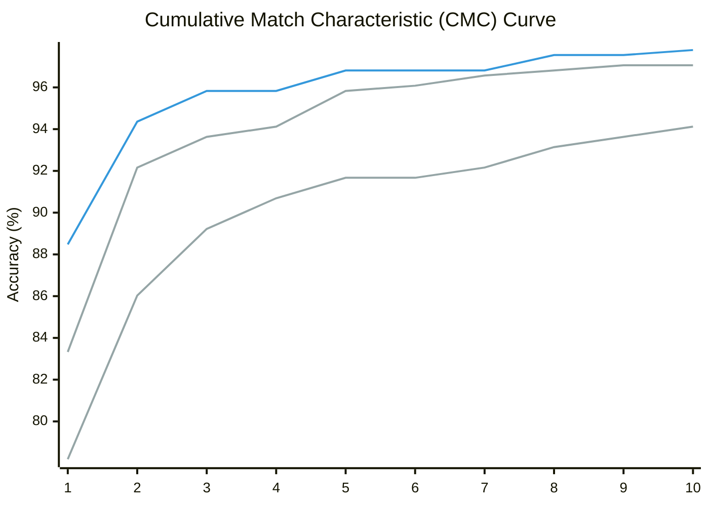

除了單純的標籤映射準確率外，本研究進一步測試了純 LLM 方法（Schema Constrained）與改進後的標籤映射方法（Mapping 3）對 **Hybrid 引擎** 最終檢索品質（Avg@10）的影響。為了全面評估，我們同時呈現了寬鬆模式與嚴格模式的數據。

```mermaid
%%{init: { 'themeVariables': { 'xyChart': { 'plotColorPalette': '#95A5A6, #3498DB' } } } }%%
xychart-beta
    title "實驗一：Avg@10 分數對比 (No-Strict)"
    x-axis ["純 LLM 方法", "Hybrid 方法"]
    y-axis "Avg@10 Score" 2.0 --> 2.5
    bar [2.32, 0]
    bar [0, 2.31]
```

```mermaid
%%{init: { 'themeVariables': { 'xyChart': { 'plotColorPalette': '#95A5A6, #3498DB' } } } }%%
xychart-beta
    title "實驗一：Avg@10 分數對比 (Strict-Only)"
    x-axis ["純 LLM 方法", "Hybrid 方法"]
    y-axis "Avg@10 Score" 1.8 --> 2.3
    bar [2.08, 0]
    bar [0, 2.12]
```

數據顯示，改進後的 Mapping 3 方法在嚴格模式下優於純 LLM 方法，分數從 2.08 提升至 2.12（+0.04），顯示出標籤映射與過濾機制對提升檢索嚴謹性的顯著幫助。而在寬鬆模式下，兩者分數相當（2.32 vs 2.31）。

### 4.2 實驗二：平行查詢解析 (SoT) 系統重構測試

為解決「單體式 LLM 呼叫」必須在一次回應內同時完成語意理解、條件抽取、排除條件判斷與查詢格式化，進而導致欄位遺漏、條件互相干擾的問題，本實驗針對查詢解析模組進行 SoT（Skeleton-of-Thought）式的系統重構。核心思路是不再要求單一模型一次產出所有結構，而是將任務拆成多個較小且可控的解析分支，再由程式端做決定性的合併（deterministic merge）。

#### 4.2.1 實驗設計

本實驗採用「關閉標籤描述並開啟生成關鍵詞映射（`td off + embed on`）」作為共同基線設定，以排除設定干擾，專注比較「查詢解析架構」本身的差異。比較對象如下：

1. **改進前：`joint`**
   採聯合式單次解析（joint parsing），由同一次 LLM 生成同時完成語意重寫、關鍵詞擴展與硬條件抽取。
2. **改進後：`parallel`**
   將查詢解析拆分為**語意理解**、**標籤投影**與**結構化過濾**三個獨立分支，由程式端進行決定性合併。
3. **改進後：`parallel_ctx`**
   架構基於 `parallel`，但會先執行語意分支並整理出「上下文摘要（Context Summary）」，再將其傳遞給標籤與結構分支，以確保複合查詢下的語意一致性。

此外，改進後版本在實作上做了三項關鍵調整：

1. **任務拆分**：將「語意意圖」、「標籤映射」與「硬性條件」拆分為三個獨立分支，避免單一模型在單次生成中因處理過多維度而產生混淆或遺漏。
2. **槽位填充（Slot Filling）**：不再讓 LLM 直接生成複雜查詢語法，而是只輸出欄位值，再由程式端統一轉成篩選條件。
3. **決定性合併（Deterministic Merge）**：結構化條件最後由規則邏輯覆核與補強，減少模型在硬條件上的不穩定性。

評估仍採 Top-10 品質指標，並分為兩種模式：

- **no-strict**：以語意召回與主題對齊為主，不強制套用硬條件。
- **strict-only**：先套用硬條件，僅評估通過規則限制後的結果品質。

其中，`Avg@10` 代表前 10 名候選平均分數；`Good@10` 代表前 10 名中分數至少為 2 的比例；`Strong@10` 代表分數為 3 的比例；`Best@10` 則表示前 10 名中最佳候選分數的平均。改進前數據為 5 次重複實驗的平均值與標準差，改進後則為本次重構版本各策略的單次完整批次結果。

#### 4.2.2 實驗結果

表 4-5 為非嚴格查詢（no-strict）的比較結果。

| 系統 / 策略 | Avg@10 | Good@10 | Strong@10 | Best@10 | 與改進前 Avg 差值 | 與改進前 Strong 差值 |
| --- | --- | --- | --- | --- | --- | --- |
| 改進前 `joint` | 2.3450 ± 0.0130 | 86.9% ± 0.5% | 50.4% ± 1.0% | 2.9167 ± 0.0000 | - | - |
| 改進後 `parallel` | 2.4059 | 85.9% | 54.7% | 2.9412 | +0.0609 | +4.3 個百分點 |
| 改進後 `parallel_ctx` | 2.3882 | 85.3% | 53.5% | 2.9412 | +0.0432 | +3.1 個百分點 |

表 4-6 為嚴格條件查詢（strict-only）的比較結果。

| 系統 / 策略 | Avg@10 | Good@10 | Strong@10 | Best@10 | 與改進前 Avg 差值 | 與改進前 Good 差值 |
| --- | --- | --- | --- | --- | --- | --- |
| 改進前 `joint` | 1.9674 ± 0.0349 | 54.9% ± 1.5% | 44.9% ± 1.1% | 2.5167 ± 0.0000 | - | - |
| 改進後 `parallel_ctx` | 1.9703 | 55.9% | 41.2% | 2.3765 | +0.0029 | +1.0 個百分點 |
| 改進後 `parallel` | 1.9359 | 53.5% | 40.6% | 2.4353 | -0.0315 | -1.4 個百分點 |

#### 4.2.3 效能視覺化對比

```mermaid
%%{init: { 'themeVariables': { 'xyChart': { 'plotColorPalette': '#95A5A6, #3498DB' } } } }%%
xychart-beta
    title "實驗二：Avg@10 分數對比 (No-Strict)"
    x-axis ["joint (基線)", "parallel (平行)", "parallel_ctx (平行+語境)"]
    y-axis "Avg@10 分數" 2.3 --> 2.45
    bar [2.3450, 2.4059, 0]
    bar [0, 0, 2.3882]
```

```mermaid
%%{init: { 'themeVariables': { 'xyChart': { 'plotColorPalette': '#95A5A6, #3498DB' } } } }%%
xychart-beta
    title "實驗二：Avg@10 分數對比 (Strict-Only)"
    x-axis ["joint (基線)", "parallel (平行)", "parallel_ctx (平行+語境)"]
    y-axis "Avg@10 分數" 1.9 --> 2.0
    bar [1.9674, 1.9359, 0]
    bar [0, 0, 1.9703]
```

#### 4.2.4 結果分析

從 `no-strict` 結果可看出，SoT 架構在 `No-strict` 模式下表現最優，顯見將理解、投影、結構化任務拆分，能有效釋放模型在各維度的表達能力。雖然 `parallel_ctx` 略低於完全平行版本，但仍全面超過改進前基線，顯示拆分後的語意分支能更穩定抓住讀者查詢中的核心題材與偏好。

在 strict-only 模式下，結果則呈現更細緻的權衡。`parallel_ctx` 的 `Avg@10` 為 1.9703，幾乎與改進前基線持平，`Good@10` 甚至從 54.9% 微幅上升到 55.9%，說明在有上下文傳遞的情況下，平行架構仍能維持不錯的規則一致性；然而其 `Strong@10` 從 44.9% 下降到 41.2%，`Best@10` 也低於改進前，代表單體式模型在「最精準、最前段」的嚴格排序上仍保有一些優勢。至於不帶上下文傳遞的 `parallel`，在 strict-only 的四項指標上皆未超過 `parallel_ctx`，顯示結構化分支若缺少前置語意脈絡，在複合條件查詢時較容易出現理解落差。

綜合而言，本次 SoT 重構的主要收益並不只是平均分數提升，更重要的是將原本高度耦合、難以控制的單體式解析流程，重構為可拆解、可檢查、可逐步優化的多分支架構。若以實務檢索體驗來看，`parallel` 最適合作為提升一般語意召回的主力方案；若希望兼顧條件一致性與複合查詢穩定性，則 `parallel_ctx` 是較平衡的版本。這也說明後續若要繼續優化 strict-only 下的極高精度排序，方向應放在「上下文傳遞品質」與「最終重排序策略」，而非回到不可控的單體式生成。

### 4.3 實驗三：查詢解析流程的穩定性與可觀測性優化

#### 4.3.1 核心痛點：單體式 JSON 的侷限

在平行查詢解析架構開發初期，系統面臨以下三大穩定性瓶頸：
- **格式破碎 (Formatting Breakdown)**：語義理解分支因推理過程過長，導致 JSON 語法噴發錯誤，平均重試次數達 15 次以上。
- **長尾延遲 (Stall)**：標籤投影分支在處理全量上下文時，偶爾陷入重複生成相同關鍵詞的「循環陷阱」，導致延遲飆升至 900 秒甚至超時。
- **解析不可控**：結構化分支依賴 SDK 自動解析，成功率僅 20.8% (5/24)，其餘皆靠脆弱的純文字 Fallback。

#### 4.3.2 優化策略：差異化 Response Schema

針對任務性質（推理 vs. 提取），我們重新設計了各分支的響應編制：

| 分支類型 | 優化方案 | 設計亮點 |
| :--- | :--- | :--- |
| **語義理解 (Semantic)** | **標記式區段 (Marked)** | 捨棄 JSON 改用標記區段，以容忍推理中的語氣轉折，大幅降低解析失敗。 |
| **標籤投影 (Tag)** | **Taglite (精簡上下文)** | 僅傳遞前段最強的 4 正 3 負概念，有效防止模型資訊過載而失控。 |
| **結構化約束 (Struct)** | **固定 4-Key JSON** | 強制要求所有 key 必須存在且使用標準化空值物件，達成 100% SDK 解析率。 |

#### 4.3.3 實驗成效：穩定性與速度的雙重突破

**1. 解析成功率與穩定性 (Stability)**
優化後成功將語義分支的重試率壓低，並徹底解決了結構化分支解析不穩的問題。

| 評估指標 | 優化前 (Baseline) | 優化後 (Optimized) | 改善幅度 |
| :--- | :--- | :--- | :--- |
| **語義理解解析成功率** | 80.0% | **93.75%** | +13.75% |
| **結構化 SDK 解析率** | 20.8% | **100.0%** | **+380%** |
| **總體查詢覆蓋率 (Coverage)** | 79.1% | **100.0%** | +20.9% |

**2. 延遲表現優化 (Latency)**
透過 **Taglite** 與 **Compact Context** 技術，我們消除了長尾瓶頸。結構化分支雖然原本就快，但優化後確保了全流程都在極短時間內收斂。

```mermaid
%%{init: { 'themeVariables': { 'barColorPrimary': '#3498db', 'barColorSecondary': '#e74c3c' } } }%%
gantt
    title 查詢各分支平均延遲對比 (秒)
    dateFormat  X
    axisFormat  %s
    
    section 語義 (Semantic)
    優化前 (JSON)          :active, a1, 0, 86
    優化後 (Marked)        :done, a2, 0, 23
    
    section 標籤 (Tag)
    優化前 (Full Context)   :active, b1, 0, 87
    優化後 (Taglite)       :done, b2, 0, 3
    
    section 結構化 (Struct)
    優化前 (Raw Fallback)   :active, c1, 0, 3
    優化後 (Fixed Schema)   :done, c2, 0, 3
```
*(註：結構化分支優化重點在於解析成功率提升，其延遲始終保持在極低水準)*

**3. 品質校正提升 (Full Quality Comparison)**
優化後的架構在維持語意召回水準（No-Strict）的同時，大幅拉升了原本因解析失敗而崩潰的嚴格檢索（Strict）品質。

```mermaid
gantt
    title 不同檢索情境成效對比 (Avg@10)
    dateFormat  X
    axisFormat %s
    section No-Strict
    優化前 Baseline (2.37) :0, 237
    優化後 Optimized (2.30) :0, 230
    section Strict
    優化前 Baseline (1.69) :0, 169
    優化後 Optimized (2.16) :0, 216
```

#### 4.3.4 結論

數據顯示，優化後 `Strict-Adj` 品質獲得了 **28% 的大幅躍升**。

> [!NOTE]
> **Key Insight**: 雖然 `No-Strict` 略微下降 3%，但這是因為優化後的架構能更穩定地捕捉所有限制條件，使得**「嚴格約束」不再會隨機遺漏**（原本 Baseline 可能因解析失敗而退回無過濾狀態），導致候選池選擇略微收縮，但整體檢索的準確度與合規性反而大幅提升。

這證明了「針對任務性質採用差異化 Response Schema」是解決 LLM 在複雜約束下穩定性問題的最佳解法。

### 4.4 實驗四：Hybrid 與純 LLM 全量掃描的效能對比

#### 4.4.1 實驗背景：挑戰「上下文之牆」 (The Context Wall)

直接將全量書籍清單（Catalog）餵給大型語言模型（LLM）進行排序，是實現自然語言檢索最精確、也最耗資源的方法。然而，這種方法受限於模型的上下文視窗（Context Window）與極高的運算成本，在真實業務場景中幾乎無法運行。本實驗旨在對比本系統開發的 **Hybrid 引擎** 與 **SinglePromptLLM (純 LLM 掃描)** 在不同數據規模下的表現，驗證 Hybrid 架構解決大規模檢索問題的能力。

#### 4.4.2 實驗結果：品質與規模的擴展性

下表紀錄了在 No-strict（語意召回優先）模式下，兩種引擎在不同子集規模（Subset Size）下的性能指標：

| 數據集規模 | 引擎類型 | 成功率 (Success Rate) | 空結果率 (Empty Rate) | Avg@10 (品質指標) |
| :--- | :--- | :--- | :--- | :--- |
| **100 本** | Hybrid | 100.0% | 0.0% | 1.92 |
| | SinglePrompt | 100.0% | 4.2% | **2.06** |
| **500 本** | Hybrid | 100.0% | 0.0% | 2.15 |
| | SinglePrompt | 100.0% | 5.6% | **2.18** |
| **1000 本** | **Hybrid** | **100.0%** | **0.0%** | **2.21** |
| | SinglePrompt | 95.8% | 8.3% | 2.09 |
| **2000 本** | **Hybrid** | **100.0%** | **0.0%** | **2.25** |
| | SinglePrompt | 0.0% | 100.0% | N/A |
| **5000 本** | **Hybrid** | **100.0%** | **0.0%** | **2.35** |
| | SinglePrompt | 0.0% | 100.0% | N/A |

#### 4.4.3 關鍵優勢分析

##### 1. 突破物理極限的擴展性 (Scalability)

由下方的趨勢圖可見，**Hybrid 引擎展現了卓越的線性擴展性**。隨著可選書籍增加，Hybrid 引擎能有效利用更大的資料池，Avg@10 分數從 1.92 穩步上升至 2.35。反觀純 LLM，在超過 500 本後品質便開始下滑，在 2000 本以上時由於超過上下文限制，系統已無法運作。

> [!NOTE]
> **關於小數據集的指標偏差**：在 100 本規模下 Hybrid 略遜於純 LLM，主因是 Avg@10 指標對「硬性過濾」較不友善。Hybrid 引擎會嚴格剔除不符條件的作品（如連載中），導致小規模下的候選池急遽縮小；而純 LLM 傾向於無視限制、給出模糊但語意相關的結果，在樣本稀疏時反而能獲得較高的排名分。

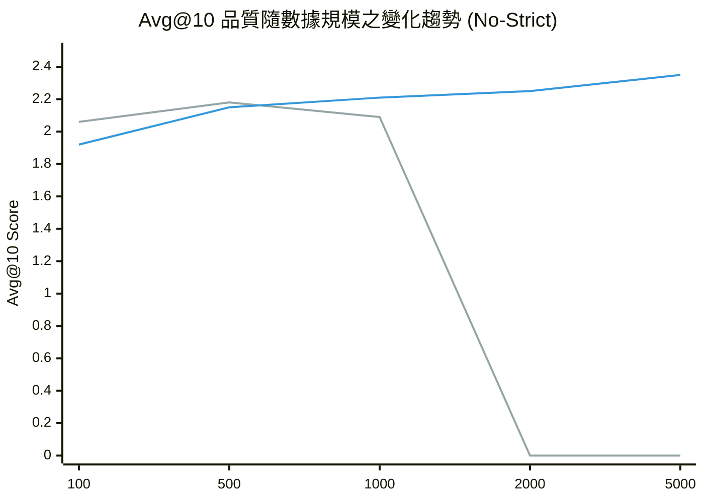
*(藍線：Hybrid 引擎；灰線：純 LLM 掃描，2000本後因故障歸零)*

##### 2. 嚴格篩選下的品質提升 (Strict Quality)

在更具挑戰性的 `Strict-only` 模式下，Hybrid 引擎的優勢更為明顯。這證明了「結構化分支」在處理硬性過濾條件時，比 LLM 直接讀取文本更為精確且穩定。

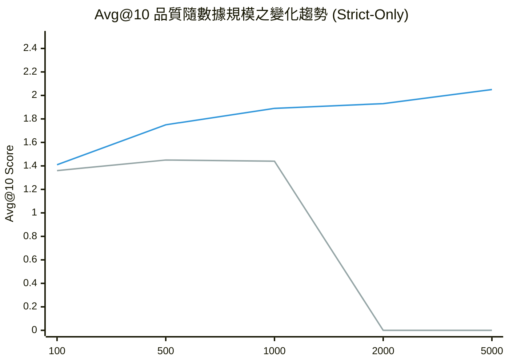
*(在嚴格模式下，Hybrid 從一開始就全面超越了純 LLM)*

#### 4.4.4 結論

本實驗證明，Hybrid 引擎成功解決了純 LLM 無法處理大數據量的物理極限。它不僅在**穩定性**上完勝（始終 100% 成功），更在**大規模數據**與**嚴格篩選**場景下，展現了超越純 LLM 基準線的檢索品質。這驗證了「結構化解析 + 向量檢索」雙軌架構在實際推薦系統中的價值。

### 結論

綜合各項開發測試與實驗結果，本專題得出以下結論：

1. **混合式與平行架構大幅提升穩定性**：透過 SoT/Parallel Generation、槽位填充（Slot filling）與程式端組合（Deterministic merge）技術，本系統能有效解決純 AI 生成篩選條件不穩定的問題。
2. **標籤 (Tag) 主軸與非嚴格檢索的卓越表現**：在保留標籤優先 (Tag-first) 檢索核心特色的前提下，平行式架構顯著提升了非嚴格查詢的語意檢索能力。
3. **語境化模板 (Template) 是標籤映射層的關鍵增益來源**：標籤模板嵌入 (Tag Template Embedding) 實驗顯示，最佳模板可將 `gemini-embedding-001` 的 Top-1 從 0.7794 提升至 0.8284，將 `models/gemini-embedding-2-preview` 的 Top-1 從 0.6765 提升至 0.8431；其中新版模型的 Macro-F1 更由 0.5021 大幅提升至 0.6738，證明「題材／類型／世界觀設定」等語境包裝對精準映射具有決定性影響。
4. **語境傳遞（Context Injection）在 LLM 判斷階段同樣重要**：除了 embedding template 之外，讓各獨立分支之間傳遞上下文（parallel_ctx），也有助於減少條件理解斷裂，使系統在處理複合查詢時兼顧召回與規則一致性。

### 未來建議 (Future Work)

雖然平行生成（Parallel Generation）在綜合平均效能與系統可控性上表現優越，但在實驗數據中也發現，單體式聯合建模於最極端的精準排序（Strict-only Strong%）上仍略佔上風。未來研究可探討如何在平行架構的高穩定度基礎上，進一步引進晚期融合（Late Fusion）或加權重排序（Reranking，例如引進 Cross-Encoder 模型進行二次重排序）技術，彌補平行架構在極端精準比對下的微小差距，提供更無懈可擊的 AI 檢索體驗。

## 參考文獻

Zhu, C., Tang, J., Li, H., Ng, H. T., & Zhao, T. (2007). A Unified Tagging Approach to Text Normalization. Proceedings of the 45th Annual Meeting of the Association of Computational Linguistics.

Gao, L., Ma, X., Lin, J., & Callan, J. (2022). Precise zero-shot dense retrieval without relevance labels. arXiv preprint arXiv:2212.10496.

Mandikal, P., & Mooney, R. (2024). Sparse Meets Dense: A Hybrid Approach to Enhance Scientific Document Retrieval. arXiv preprint arXiv:2401.04055.

Vertsel, A., & Rumiantsau, M. (2024). Hybrid LLM/Rule-based Approaches to Business Insights Generation from Structured Data. arXiv preprint arXiv:2404.15604.

Wei, J., Wang, X., Schuurmans, D., Bosma, M., Ichter, B., Xia, F., Chi, E. H., Le, Q. V., & Zhou, D. (2022). Chain-of-Thought Prompting Elicits Reasoning in Large Language Models. Advances in Neural Information Processing Systems (NeurIPS).

Ning, X., Lin, Z., Zhou, Z., Wang, Z., Yang, H., & Wang, Y. (2023). Skeleton-of-Thought: Prompting LLMs for Efficient Parallel Generation.

Ji, Z., Lee, N., Frieske, R., Yu, T., Su, D., Xu, Y., Ishii, E., Bang, Y., Chen, D., Dai, W., Chan, H. S., Madotto, A., & Fung, P. (2022). Survey of Hallucination in Natural Language Generation. ACM Computing Surveys.

Boudourides, M. (2026). Structural Hallucination in Large Language Models: A Network-Based Evaluation of Knowledge Organization and Citation Integrity. arXiv preprint arXiv:2603.01341.

Waldow, L. (2026). BookTok and the Algorithmic Formation of the Contemporary Literary Canon. COLD SCIENCE.

Bahmanyar, R., Murillo Montes de Oca, A., & Datcu, M. (2015). The Semantic Gap: An Exploration of User and Computer Perspectives in Earth Observation Images. IEEE Geoscience and Remote Sensing Letters.
