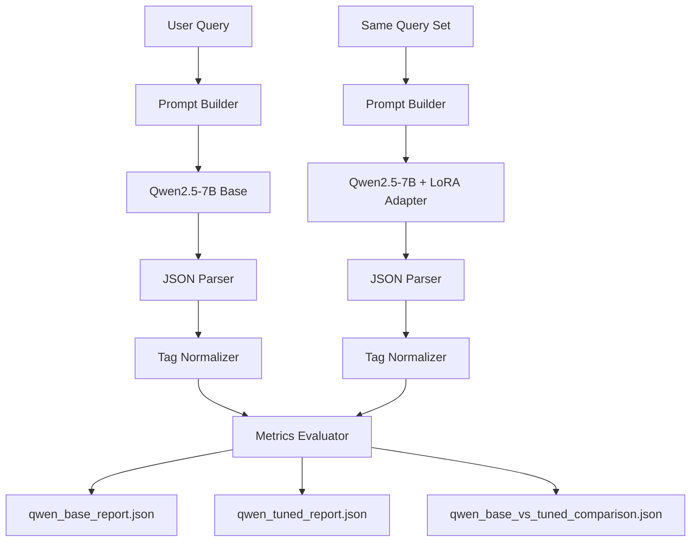

# Qwen 標籤抽取實驗（設計原理與測試結果）

本文件對齊專案中的方法論報告與系統架構文件，聚焦在「Qwen 標籤抽取」這條子系統：

- 如何把找書需求轉成合法 taxonomy 標籤
- 為何採用 QLoRA + 固定 JSON 輸出格式
- 如何以 base vs tuned 做同場比較
- 本次實測結果與目前阻塞點

## 1. 實驗目標

本實驗評估任務是：

- 輸入：使用者找書需求文字
- 輸出：`final_tags`（必須屬於 `data/all_tags.json`）

核心問題不是自由生成品質，而是「受限標籤空間下的多標籤抽取穩定性」。
因此我們同時看格式可解析率、taxonomy 合法性、required/blocked 規則符合度與 F1。

## 2. 設計原理

## 2.1 系統流程（Qwen Tagger 子系統）

重點是使用同一批 queries、同一解碼參數，避免比較偏差。

## 2.2 方法選擇

- 使用 `Qwen/Qwen2.5-7B-Instruct` 作為 base，維持通用語言能力。
- 使用 LoRA Adapter 疊加在 base 權重上，降低訓練與部署成本。
- 使用 4-bit 量化（NF4）控制顯存占用。
- 強制輸出 JSON（含 `thinking`、`final_tags`）以降低下游解析不確定性。

QLoRA 的更新可寫成：

$$
W' = W + \Delta W,\quad \Delta W = BA
$$

其中 $W$ 為凍結權重，$A, B$ 為低秩可訓練矩陣。

## 2.3 與主系統的關係

- 主系統架構仍是「解析 + 混合檢索 + 規則過濾」主線。
- Qwen Tagger 是前段語義轉標籤模組，用來穩定輸出可控標籤集合。
- 此模組輸出可被後續檢索/規則引擎直接消費，減少 query 歧義。

## 3. 評估設計

## 3.1 資料來源

- Query 集合：`queries.json`（自動 fallback 到多個預設路徑）
- Taxonomy：`data/all_tags.json`
- 比較模型：
	- Base：Qwen2.5-7B-Instruct
	- Tuned：Qwen2.5-7B-Instruct + `data/models/qwen25_7b_tag_lora/checkpoint-*`

## 3.2 指標

- `parse_success_rate`：輸出可被 JSON 正確解析的比例
- `raw_outside_taxonomy_rate`：原始輸出中非法標籤比例（越低越好）
- `required_exact_cover_rate`：required_tags 是否完整覆蓋
- `blocked_clean_rate`：blocked_tags 是否完全避開
- `required_micro_f1`、`required_macro_f1`：多標籤品質

## 3.3 執行腳本

- 主腳本：`src/eval/generate_qwen_tag_run.py`
- 主要參數：
	- `--max-samples`：小樣本 smoke 或 pilot
	- `--skip-tuned`：只跑 base
	- `--output-dir`：控制結果輸出路徑

## 4. 測試結果（本輪實測）

## 4.1 執行狀態

本輪在本機（Windows + RTX 4060 Laptop 8GB）執行時，
base 模型初始化階段出現顯存配置失敗：

- 錯誤型態：`ValueError`（部分模組被分派到 CPU/disk，4-bit 量化啟動失敗）
- 發生位置：`AutoModelForCausalLM.from_pretrained(..., device_map="auto", quantization_config=BitsAndBytesConfig(...))`
- 直接結果：本輪未成功落地 `qwen_base_report.json` / `qwen_tuned_report.json`

## 4.2 可確認事實

- 測試流程已可正常進入 batch 啟動與模型載入階段。
- 指令與資料路徑解析正常（queries/tags/adapter path 解析可通過）。
- 目前阻塞點是本機推論資源配置，不是評估邏輯或資料格式錯誤。

## 4.3 待補的最終結果檔

成功跑完後，應在 `data/experiments/qwen_tag_runs/` 看到：

- `qwen_base.json`
- `qwen_base_report.json`
- `qwen_tuned.json`
- `qwen_tuned_report.json`
- `qwen_base_vs_tuned_comparison.json`

## 5. 結論與下一步

結論：Qwen 標籤抽取實驗設計已完整，且具備可重現的 base vs tuned 比較框架；
目前主要風險是 7B 模型在本機 VRAM 條件下的載入穩定性。

建議下一步：

1. 以更保守的 `device_map`/offload 設定重跑，先確保 base 報告可落地。
2. base 跑通後再跑 tuned，最後用 comparison 檔做 delta 判讀。
3. 將本節 `4. 測試結果` 更新為正式數值表（parse success / outside taxonomy / F1 / cover/clean）。
