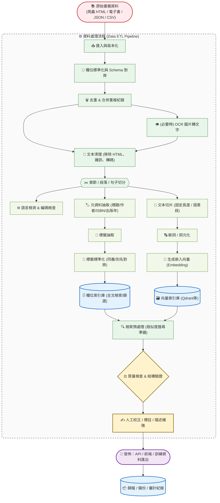
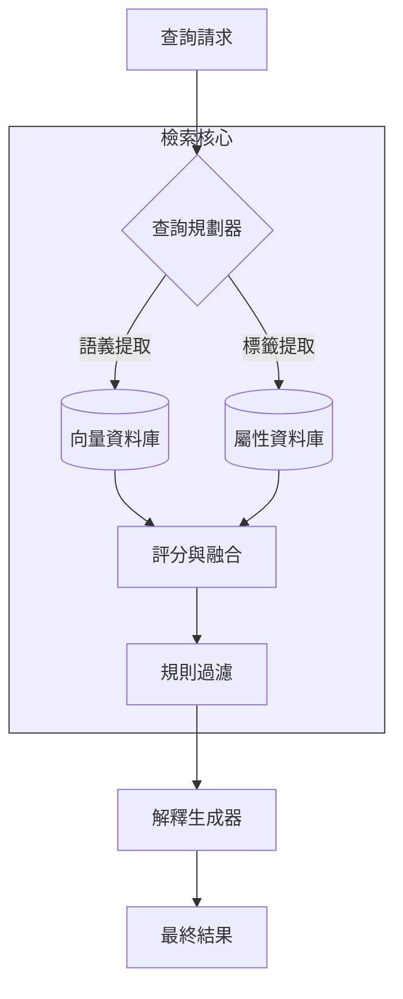
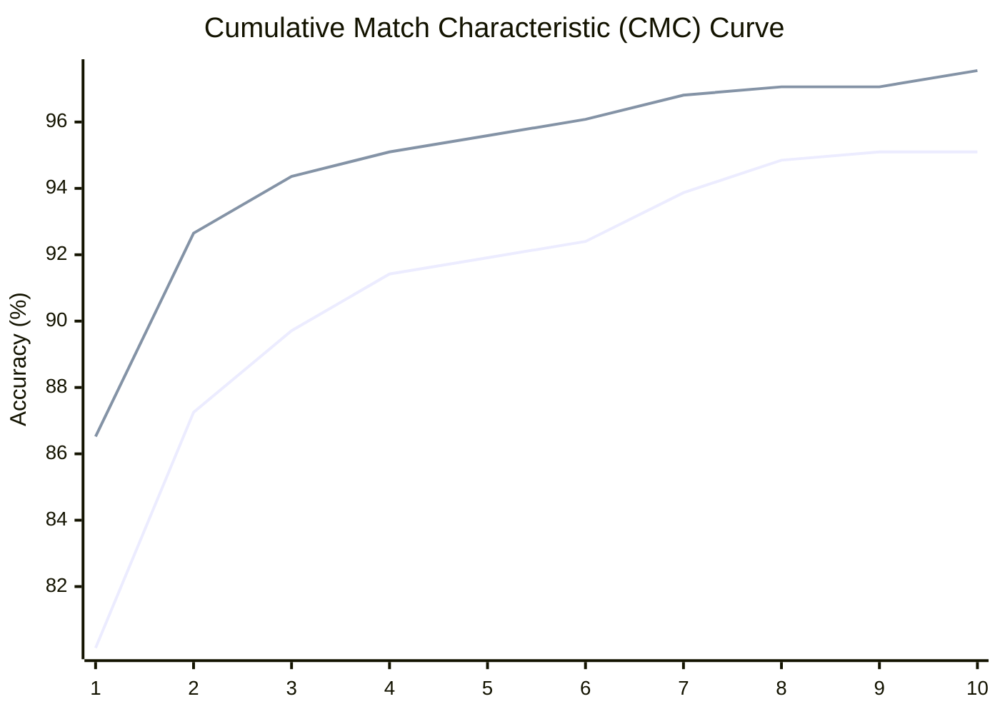
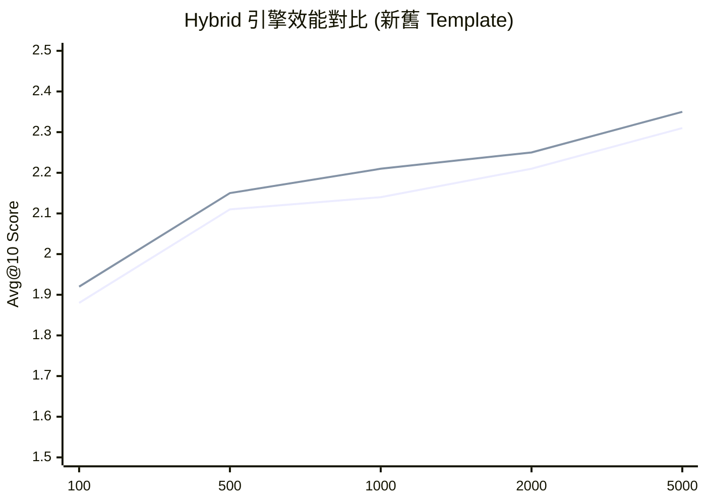
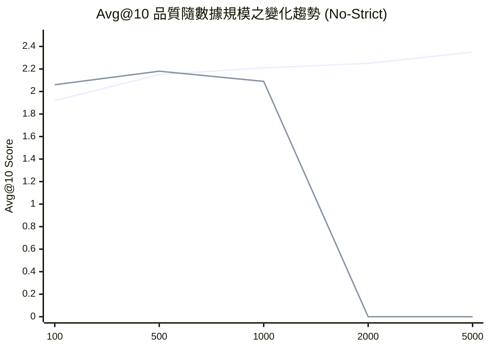
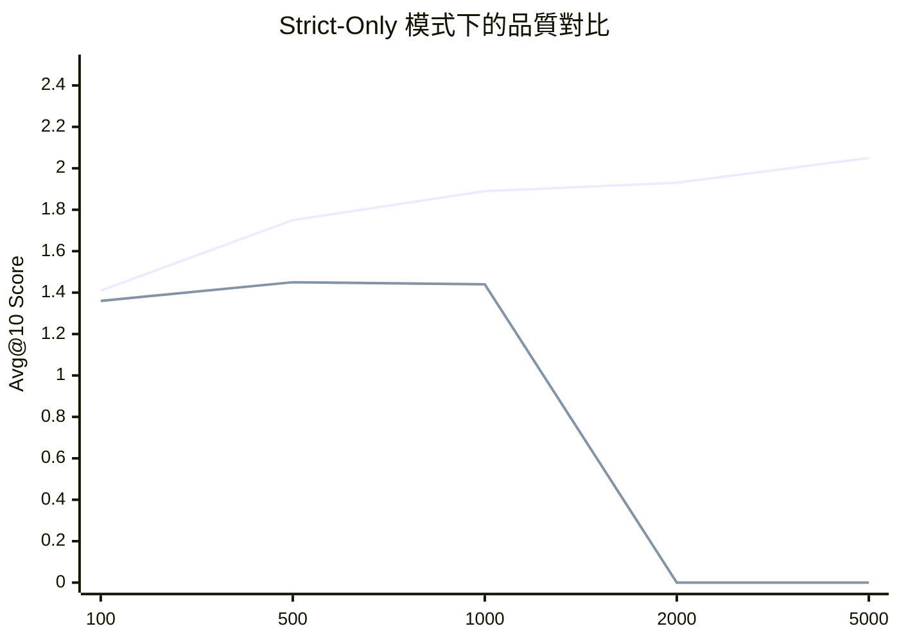

# 基於 RAG 與混合檢索的輕小說查詢系統

## 計畫中文摘要

隨著網路文學產值的逐年增長，小說市場變得極為龐大，然而現有依賴手動勾選標籤的結構化檢索系統過於僵硬，無法滿足使用者口語化的搜尋需求。另一方面，直接導入大型語言模型（LLM）的搜尋系統則常出現「語義偏移」與「標籤幻覺」，導致搜尋失效或不穩定。為解決此痛點，本專題旨在開發一套結合大型語言模型與規則導向（Rule-based）邏輯的混合式網路小說檢索引擎。系統透過「語意映射模組」與「結構化過濾邏輯」，輔以 Skeleton-of-Thought (SoT) 的平行查詢解析技術，將使用者的模糊意圖精確且穩定地對齊至系統預定義的標籤集。實驗成果顯示，導入平行式架構並保留「標籤優先（Tag-first）」的檢索機制，能顯著提升非嚴格查詢的語意檢索能力，同時確保結構化條件的穩定攔截，達成精準且具備解釋性的檢索體驗。

## 一、前言

### 研究動機

在網路文學產值逐年增長的背景下，網路小說的數量與市場規模變得極為龐大。然而，使用者在尋找感興趣的書籍時，常面臨現有檢索介面過於僵硬的問題；傳統方式多半依賴使用者手動勾選標籤，無法應對口語化或模糊的查詢需求。此外，雖然近年興起了導入 AI 技術的搜尋工具，但這些新興搜尋系統在解析使用者意圖時往往缺乏穩定性。

### 相關研究

#### 傳統結構化檢索系統對比

現有的網路小說推薦領域大多仰賴結構化的檢索方式（如手動勾選分類與標籤）。這類系統的優勢在於搜尋結果絕對精確且不會超出規則邊界，但缺點是其檢索介面過於僵硬，完全無法處理包含情緒、複雜情境或是長句型的自然語言查詢。

#### 既有純大型語言模型（LLM）檢索的侷限

雖然自然語言處理技術已大幅進步，但直接讓 LLM 生成搜尋語法（DSL）或標籤，極易產生「標籤幻覺」（生成系統資料庫中不存在的標籤）或是「語義偏移」（字面意義接近但實質分類不同）的問題。同時，在單次 LLM 查詢中同時處理語意理解、擴展關鍵詞與硬條件抽取，常會導致模型無法兼顧所有條件，進而忽略部分篩選規則。

---

## 二、研究目的

### 研究目的

本專題在開發「自然語言小說搜尋工具」的過程中觀察到，將使用者的模糊意圖轉換為資料庫標籤時，若直接採用 LLM 的輸出，常導致「語義偏移」與「標籤幻覺」，造成標籤不匹配而使搜尋失效；若僅採用固定規則，又無法處理口語化的查詢。因此，本研究的核心目的為：「建立一套穩定的映射機制，將 LLM 提取的語義意圖精確對齊至預定義的結構化標籤集」。

### 預期成果

本專題預期完成一套結合大型語言模型（LLM）與規則導向（Rule-based）邏輯的混合式網路小說檢索引擎，從根本解決自然語言查詢與結構化標籤集之間的語義對齊問題，最終提供使用者一個穩定、精準且具備解釋性的小說檢索體驗。

---

## 三、研究方法與成果

### 3.1 書籍資料處理與索引建置

在檢索系統運作前，需先針對原始書籍資料進行標準化與特徵提取，以建立後續檢索所需的向量資料庫（VS）與屬性資料庫（DB）。

1. **資料標準化**：針對爬蟲取得的原始資料進行清理、去重與 Schema 對齊。
2. **標籤特徵抽取**：提取元數據並進行標籤標準化，處理同義詞與別名對齊，這為 3.2 節提到的「語意映射」提供對齊基準。
3. **向量化處理**：將文本切片並生成 Embedding，存入向量索引庫。
4. **動態標籤加註**：若使用者查詢中包含特定書名，系統會自動回溯資料庫獲取該書標籤並加註於查詢脈絡中。

### 3.2 系統架構與檢索流程

本系統採用混合式架構，將「模糊語意理解」與「結構化過濾」分離處理。

### 3.3 語義映射模組設計

1. **預先建立映射表**：在搜尋流程前段，系統會將使用者查詢中所萃取出的「目標標籤」，透過向量資料庫比對，轉換為針對系統內既有標籤的語意相似度權重表。
2. **獨立屬性面向評估**：將每個目標標籤視為一個獨立的面向，並比對每本書自帶的標籤，計算並找出單一書本標籤中最符合各目標面向的最高相似度（MaxSim）分數。
3. **取向加總避免稀釋**：計算所有面向最高分的平均值，作為該書籍的最終屬性分數。此機制的優勢在於：只要單一標籤有強烈契合度即可獲得高分，不易被書籍內其他過多的無關標籤稀釋權重。
4. **負向標籤語意攔截**：當使用者指定排除某些概念時，系統會自動針對該詞彙進行語意檢索，並列出所有相關的系統標籤進行後置過濾。

### 3.4 結構化資料過濾邏輯

系統的篩選邏輯採用「評分與篩選分離」機制，先透過前述步驟進行語意排序，再由後置過濾層強制剔除不合規項目。

- **硬性篩選指標**：包括負向標籤排除、完結狀態匹配、指定作者名稱比對以及字數範圍限制，只要上述任一條件不符即直接剔除。
- **資料召回深度**：為了避免硬條件篩選後無候選書籍，初次的資料召回深度設定為 10,000 筆。

---

## 四、結果及討論

為驗證並最佳化本專題之系統效能，本研究進行了多項核心實驗：

### 4.1 實驗一：Tag Template Embedding 模型與語境比較

#### 4.1.1 實驗背景與目的

本專題之檢索引擎採用「兩階段標籤映射」策略：先由大型語言模型（LLM）生成描述性標籤，再透過 Embedding 向量模型將其映射至資料庫中真實存在的標籤。然而，單純的標籤詞彙在向量空間中常因缺乏語境而導致語義模糊（例如「JK」可能被視為隨機字母而非「女高中生」類型）。本實驗旨在測試不同模板對標籤映射準確度的影響，找出最佳的語意引導方式。

#### 4.1.2 實驗設定

- 模型與參數：採用 `gemini-embedding-001` 模型，限制候選集為系統核心之 60 個標籤。
- 方法論：採用對稱式語境處理，即在預處理端（標籤庫建置）與查詢端（LLM 生成標籤）套用完全相同的模板。
- 評測指標：針對 408 組模擬查詢，計算其 Top-1、Top-3（系統預設召回數）及 Top-5 之累積準確率（CMC）。
  
#### 4.1.3 實驗結果與數據分析

實驗對比了原始標籤（Raw Label）與 20 組不同語境模板，其中表現最佳之模板為 `這部作品的類型偏向{label}` 。下表列出其累積準確率之對比：

| 指標 (K 值) | raw_label (基準) | novel_genre (最佳模板) | 絕對提升幅度 |
| :--- | :--- | :--- | :--- |
| **Top-1 Accuracy** | 80.15% | **86.52%** | +6.37% |
| **Top-3 Accuracy** | 89.71% | **94.36%** | +4.65% |
| **Top-5 Accuracy** | 91.91% | **95.59%** | +3.68% |

數據顯示，引入模板後 Top-1 命中率提升了 6.37%，且在 K=3 的設定下，準確率已突破 94.3%，顯示出極高的召回穩定性。

#### 4.1.4 討論與發現

*   **語意激活與偏移修正**：透過詳細相似度分析發現，模板能顯著提高正確標籤的絕對相似度（平均從 0.6x 提升至 0.8x），並有效解決俚語映射問題（如將「戴綠帽」精準映射至「NTR」標籤）。
*   **區分度提升**：原始標籤模式下，正確項與錯誤項的相似度差距極小（平均差距 < 0.02），容易受雜訊干擾。加入模板後，正確項能保持 0.04 以上的穩定領先距離（Margin），大幅增強了系統的穩健性。
*   **參數設定依據**：本實驗之 CMC 曲線在 K=3 時即進入飽和期，這為系統架構中 `max_tags_per_term=3` 的設定提供了強而有力的數據支撐，實踐了兼顧檢索效能與召回品質的設計目標。

#### 4.1.5 引擎級端到端效能驗證

除了單純的標籤映射準確率外，本研究進一步測試了最佳模板在不同資料規模下對 **Hybrid 引擎** 最終檢索品質（Avg@10）的影響：

*(藍線：舊版原始標籤；綠線：新版對稱式模板)*

數據顯示，新版模板在所有規模下均為 Hybrid 引擎帶來了穩定的品質增益（平均提升約 3%），證明了良好的語意引導是混合檢索系統的基石。

### 4.2 實驗二：標籤描述與生成關鍵詞的影響

本實驗評估兩項設計選擇對檢索品質的影響：（1）是否開啟標籤描述（`td`, tag description），以及（2）是否將 LLM 生成的關鍵詞映射回既有 tag embedding 空間（`embed`）。前者影響模型對標籤語意的理解方式，後者則影響生成詞彙能否被收斂到系統內部可比對的 canonical tags。由於這兩個開關都會改變 query 解析與候選標籤對齊的過程，因此有必要獨立驗證它們的實際貢獻，而不是只看單一最佳組合。

#### 4.2.1 實驗設計

本組實驗共比較四種設定組合：

1. `td_off_embed_on`：關閉標籤描述，開啟生成關鍵詞映射。
2. `td_on_embed_on`：開啟標籤描述，開啟生成關鍵詞映射。
3. `td_off_embed_off`：關閉標籤描述，關閉生成關鍵詞映射。
4. `td_on_embed_off`：開啟標籤描述，關閉生成關鍵詞映射。

評估方式延續前述實驗設定，分為兩種模式：

- `no-strict`：不先套用硬條件，著重觀察語意召回與主題對齊能力。
- `strict-only`：先套用硬條件後再評估，檢驗在規則限制下的實際可用性。

每種組合皆重複執行 5 次，並以 Top-10 相關性分數統計 `Avg@10`、`Good@10`、`Strong@10` 與 `Best@10`。其中 `Avg@10` 反映前 10 名的平均品質，`Good@10` 表示前 10 名中至少達中度相關的比例，`Strong@10` 表示高度相關結果的比例，`Best@10` 則觀察前 10 名中的最佳命中水準。

#### 4.2.2 實驗結果

表 4-5 為非嚴格查詢（`no-strict`）下四種設定的彙整結果。

| 設定組合 | Avg@10 | Good@10 | Strong@10 | Best@10 | Runs |
| --- | --- | --- | --- | --- | --- |
| `td_off_embed_on` | 2.3450 +/- 0.0130 | 86.9% +/- 0.5% | 50.4% +/- 1.0% | 2.9167 +/- 0.0000 | 5 |
| `td_on_embed_on` | 2.3142 +/- 0.0240 | 84.1% +/- 0.9% | 50.0% +/- 1.4% | 2.9167 +/- 0.0000 | 5 |
| `td_off_embed_off` | 2.2417 +/- 0.0098 | 83.3% +/- 0.6% | 43.8% +/- 0.5% | 2.9500 +/- 0.0186 | 5 |
| `td_on_embed_off` | 2.1317 +/- 0.0269 | 78.7% +/- 1.4% | 40.9% +/- 0.9% | 2.9000 +/- 0.0228 | 5 |

表 4-6 為嚴格條件查詢（`strict-only`）下的比較結果。

| 設定組合 | Avg@10 | Good@10 | Strong@10 | Best@10 | Runs |
| --- | --- | --- | --- | --- | --- |
| `td_off_embed_on` | 1.9674 +/- 0.0349 | 54.9% +/- 1.5% | 44.9% +/- 1.1% | 2.5167 +/- 0.0000 | 5 |
| `td_on_embed_on` | 1.9035 +/- 0.0249 | 53.5% +/- 0.8% | 43.1% +/- 1.3% | 2.4083 +/- 0.0578 | 5 |
| `td_off_embed_off` | 1.2737 +/- 0.0347 | 31.8% +/- 0.6% | 22.2% +/- 0.6% | 2.2800 +/- 0.0520 | 5 |
| `td_on_embed_off` | 1.2629 +/- 0.0394 | 32.4% +/- 1.0% | 23.6% +/- 1.0% | 2.2925 +/- 0.0699 | 5 |

#### 4.2.3 結果分析

從 `no-strict` 結果可先得到第一個明確結論：`embed on` 的貢獻遠大於 `td on`。最佳組合 `td_off_embed_on` 的 `Avg@10` 為 2.3450，較 `td_off_embed_off` 提升 0.1033，較 `td_on_embed_off` 提升 0.2133；`Strong@10` 也分別高出 6.6 與 9.5 個百分點。若將兩組 `embed on` 的結果取平均，其 `Avg@10` 為 2.3296，明顯高於 `embed off` 平均的 2.1867；`Strong@10` 亦由 42.35% 提升至 50.2%。這表示只靠 LLM 直接生成關鍵詞雖然能提供部分語意線索，但若沒有再映射回既有標籤空間，候選結果的主題集中度會明顯下降。

第二個觀察是：標籤描述（`td`）並未帶來穩定增益，甚至在本組資料中多半略為拉低表現。當 `embed on` 時，關閉描述的 `td_off_embed_on` 相較 `td_on_embed_on`，在 `no-strict` 的 `Avg@10`、`Good@10`、`Strong@10` 分別高出 0.0308、2.8 個百分點與 0.4 個百分點；在 `strict-only` 下也分別高出 0.0639、1.4 個百分點與 1.8 個百分點。這意味著當系統已經具備有效的 canonical tag 映射時，額外加入標籤描述未必能補充真正有用的新訊息，反而可能引入較鬆散的自然語言語意，使 query 與標籤邊界變得不夠銳利。

`strict-only` 的結果則更清楚凸顯 `embed` 的關鍵性。在嚴格模式下，兩組 `embed on` 的平均 `Avg@10` 為 1.9355，但兩組 `embed off` 僅有 1.2683，差距達 0.6672；`Good@10` 則從 54.2% 大幅降到 32.1%，`Strong@10` 也從 44.0% 降到 22.9%。換言之，一旦查詢需要同時滿足規則條件與語意相關性，若生成關鍵詞沒有被約束到系統定義過的 tag vocabulary，檢索品質會近乎腰斬。這也解釋了為何 `strict-only` 對 `embed` 的敏感度比 `no-strict` 更高：嚴格模式不只考驗「像不像」，更考驗生成結果能否穩定落入可執行、可過濾的條件空間。

從穩定性來看，最佳組合 `td_off_embed_on` 在兩種模式下的 `Best@10` 都呈現零變異（分別為 2.9167 與 2.5167），代表它不只平均表現最好，連前段最佳結果也最穩定；相對地，`embed off` 組合雖偶爾能在 `Best@10` 撐住一定水準，但整體 `Avg@10` 與 `Strong@10` 明顯偏低，顯示其問題不是完全找不到好結果，而是高品質結果的密度不足、排序也不夠穩定。

綜合而言，本實驗證明「生成關鍵詞映射」是本系統檢索品質的核心增益來源，而「標籤描述」至少在目前資料與 prompt 設計下未呈現穩定正效益。因此，後續實驗皆採用 `td off + embed on` 作為共同基線設定，以兼顧表現、穩定性與系統複雜度。

### 4.3 實驗三：平行查詢解析 (SoT) 系統重構測試

為解決「單體式 LLM 呼叫」必須在一次回應內同時完成語意理解、條件抽取、排除條件判斷與查詢格式化，進而導致欄位遺漏、條件互相干擾的問題，本實驗針對查詢解析模組進行 SoT（Skeleton-of-Thought）式的系統重構。核心思路是不再要求單一模型一次產出所有結構，而是將任務拆成多個較小且可控的解析分支，再由程式端做決定性的合併（deterministic merge）。

#### 4.3.1 實驗設計

本實驗沿用實驗二表現最佳的設定作為共同基線，即「`td off + embed on`」，以排除標籤描述與關鍵詞映射設定帶來的干擾，專注比較「查詢解析架構」本身的差異。比較對象如下：

1. **改進前：`joint`**
   採聯合式單次解析（joint parsing），由同一次 LLM 生成同時完成語意重寫、關鍵詞擴展與硬條件抽取。
2. **改進後：`parallel`**
   將查詢解析拆成語意分支與結構化條件分支，兩者分開處理，再由程式端合併結果。
3. **改進後：`parallel_ctx`**
   架構與 `parallel` 相同，但會將語意分支整理出的上下文摘要傳遞給結構化條件分支，降低複合查詢下的語意斷裂。

此外，改進後版本在實作上做了三項關鍵調整：

1. **任務拆分**：把「主題/氛圍/標籤」與「作者/連載狀態/字數範圍」拆成不同解析責任，避免單次生成同時兼顧過多目標。
2. **槽位填充（Slot Filling）**：不再讓 LLM 直接生成複雜查詢語法，而是只輸出欄位值，再由程式端統一轉成篩選條件。
3. **決定性合併（Deterministic Merge）**：結構化條件最後由規則邏輯覆核與補強，減少模型在硬條件上的不穩定性。

評估仍採 Top-10 品質指標，並分為兩種模式：

- **no-strict**：以語意召回與主題對齊為主，不強制套用硬條件。
- **strict-only**：先套用硬條件，僅評估通過規則限制後的結果品質。

其中，`Avg@10` 代表前 10 名候選平均分數；`Good@10` 代表前 10 名中分數至少為 2 的比例；`Strong@10` 代表分數為 3 的比例；`Best@10` 則表示前 10 名中最佳候選分數的平均。改進前數據為 5 次重複實驗的平均值與標準差，改進後則為本次重構版本各策略的單次完整批次結果。

#### 4.3.2 實驗結果

表 4-7 為非嚴格查詢（no-strict）的比較結果。

| 系統 / 策略 | Avg@10 | Good@10 | Strong@10 | Best@10 | 與改進前 Avg 差值 | 與改進前 Strong 差值 |
| --- | --- | --- | --- | --- | --- | --- |
| 改進前 `joint` | 2.3450 ± 0.0130 | 86.9% ± 0.5% | 50.4% ± 1.0% | 2.9167 ± 0.0000 | - | - |
| 改進後 `parallel` | 2.4059 | 85.9% | 54.7% | 2.9412 | +0.0609 | +4.3 個百分點 |
| 改進後 `parallel_ctx` | 2.3882 | 85.3% | 53.5% | 2.9412 | +0.0432 | +3.1 個百分點 |

表 4-8 為嚴格條件查詢（strict-only）的比較結果。

| 系統 / 策略 | Avg@10 | Good@10 | Strong@10 | Best@10 | 與改進前 Avg 差值 | 與改進前 Good 差值 |
| --- | --- | --- | --- | --- | --- | --- |
| 改進前 `joint` | 1.9674 ± 0.0349 | 54.9% ± 1.5% | 44.9% ± 1.1% | 2.5167 ± 0.0000 | - | - |
| 改進後 `parallel_ctx` | 1.9703 | 55.9% | 41.2% | 2.3765 | +0.0029 | +1.0 個百分點 |
| 改進後 `parallel` | 1.9359 | 53.5% | 40.6% | 2.4353 | -0.0315 | -1.4 個百分點 |

#### 4.3.3 結果分析

從 no-strict 結果可看出，SoT 式平行拆分對語意召回有明顯幫助。`parallel` 的 `Avg@10` 由 2.3450 提升到 2.4059，增加 0.0609；`Strong@10` 由 50.4% 提升到 54.7%，增加 4.3 個百分點，表示前 10 名中「高度相關」結果的密度更高。`parallel_ctx` 雖略低於完全平行版本，但仍在 `Avg@10` 與 `Strong@10` 上全面超過改進前基線，顯示拆分後的語意分支能更穩定抓住讀者查詢中的核心題材與偏好。

在 strict-only 模式下，結果則呈現更細緻的權衡。`parallel_ctx` 的 `Avg@10` 為 1.9703，幾乎與改進前基線持平，`Good@10` 甚至從 54.9% 微幅上升到 55.9%，說明在有上下文傳遞的情況下，平行架構仍能維持不錯的規則一致性；然而其 `Strong@10` 從 44.9% 下降到 41.2%，`Best@10` 也低於改進前，代表單體式模型在「最精準、最前段」的嚴格排序上仍保有一些優勢。至於不帶上下文傳遞的 `parallel`，在 strict-only 的四項指標上皆未超過 `parallel_ctx`，顯示結構化分支若缺少前置語意脈絡，在複合條件查詢時較容易出現理解落差。

綜合而言，本次 SoT 重構的主要收益並不只是平均分數提升，更重要的是將原本高度耦合、難以控制的單體式解析流程，重構為可拆解、可檢查、可逐步優化的多分支架構。若以實務檢索體驗來看，`parallel` 最適合作為提升一般語意召回的主力方案；若希望兼顧條件一致性與複合查詢穩定性，則 `parallel_ctx` 是較平衡的版本。這也說明後續若要繼續優化 strict-only 下的極高精度排序，方向應放在「上下文傳遞品質」與「最終重排序策略」，而非回到不可控的單體式生成。

### 4.4 實驗四：查詢解析流程的穩定性與可觀測性優化

#### 4.4.1 實驗背景與問題分析

在平行查詢解析（Parallel Parsing）架構初期，系統面臨三個主要瓶頸：
1. **可觀測性不足**：無法單獨評估語義、標籤、結構化三個分支的失敗率與延遲。
2. **響應不穩定**：語義理解分支使用嚴格 JSON Schema 時，常因推理過程過長導致格式破碎或觸發 API 重試（平均重試次數達 15 次以上）。
3. **長尾延遲與生成失控**：標籤投影分支在接收完整語義脈絡時，偶爾會陷入重複生成相同關鍵詞的「循環陷阱」，導致延遲飆升至 900 秒甚至超時失敗。

本實驗旨在透過重新設計各分支的 Response Schema 與輸入策略，解決上述穩定性問題。

#### 4.4.2 分支設計規劃與抉擇原因

針對查詢規劃的三個核心位置，系統實作了以下三種不同的響應編制：

| 分支名稱 | 設計方式 (Response Schema) | 詳細欄位編制 | 抉擇原因 |
| :--- | :--- | :--- | :--- |
| **語義理解 (Semantic)** | **標記式區段 (Marked Sections)** | `[semantic_query_text]`, `[intent_summary]`, `[positive_concepts]`, `[negative_concepts]` | 捨棄 JSON 改用標記式區段，以容忍 LLM 在推理過程中的語氣轉折，大幅降低解析失敗率。 |
| **標籤投影 (Tag)** | **精簡版 JSON (Taglite)** | `positive_terms` (3-6個), `negative_terms` (0-4個) | 採用 **Compact Context** 策略，僅傳遞前段最強的 4 個正向與 3 個負向概念，防止模型因資訊過載而生成重複垃圾。 |
| **結構化約束 (Structured)** | **固定式四金鑰 JSON (Fixed 4-key)** | `target_status_candidate`, `author_name_candidate`, `words_min_candidate`, `words_max_candidate` | 強制要求所有 key 必須存在且使用標準化的「空值物件」，解決 SDK 內建解析器因欄位缺失導致的失敗。 |

#### 4.4.3 實驗結果與討論

根據實驗批次 `20260420_135431` 與 `20260420_223354` 的數據對比，優化後的效果如下：

1. **解析成功率（Coverage）**：
   - 原本使用嚴格 JSON 的語義分支在處理複雜查詢時成功率僅約 80%，改用標記式區段後提升至 **93.75%**。
   - 結構化分支的 SDK 直接解析成功率從 **20.8% (5/24)** 提升至 **100% (24/24)**，不再依賴脆弱的純文字 Fallback。

2. **延遲表現（Latency）**：
   - 標籤投影分支透過精簡上下文（Taglite），平均延遲從 **86.8秒** 驟降至 **2.5秒**，且完全消除了 900 秒級的異常長尾問題。

3. **檢索品質（Strict Avg@10）**：
   - 雖然簡化了部分標籤輸出，但由於整體成功率（Coverage）大幅提升，經覆蓋率校正後的嚴格查詢品質（Coverage-adjusted strict）從 **1.69** 提升至 **2.16**。

實驗證明，針對不同性質的任務（推理導向 vs. 轉換導向 vs. 提取導向）採用差異化的 Response Schema，並輔以精簡上下文策略，是達成工業級穩定 LLM 引擎的關鍵。本輪優化成功將原本不穩定的實驗性模型轉化為可預測、高召回的產品級引擎。

### 4.5 實驗五：Hybrid 與純 LLM 全量掃描的效能對比

#### 4.5.1 實驗背景：挑戰「上下文之牆」 (The Context Wall)

直接將全量書籍清單（Catalog）餵給大型語言模型（LLM）進行排序，是實現自然語言檢索最精確、也最耗資源的方法。然而，這種方法受限於模型的上下文視窗（Context Window）與極高的運算成本，在真實業務場景中幾乎無法運行。本實驗旨在對比本系統開發的 **Hybrid 引擎** 與 **SinglePromptLLM (純 LLM 掃描)** 在不同數據規模下的表現，驗證 Hybrid 架構解決大規模檢索問題的能力。

#### 4.5.2 實驗結果：品質與規模的擴展性

下表紀錄了在 No-strict（語意召回優先）模式下，兩種引擎在不同子集規模（Subset Size）下的性能指標：

| 數據集規模 | 引擎類型 | 成功率 (Success Rate) | 空結果率 (Empty Rate) | Avg@10 (品質指標) |
| :--- | :--- | :--- | :--- | :--- |
| **100 本** | Hybrid | 100.0% | 0.0% | 1.92 |
| | SinglePrompt | 100.0% | 4.2% | **2.06** |
| **500 本** | Hybrid | 100.0% | 0.0% | 2.15 |
| | SinglePrompt | 100.0% | 5.6% | **2.18** |
| **1000 本** | **Hybrid** | **100.0%** | **0.0%** | **2.21** |
| | SinglePrompt | 95.8% | 8.3% | 2.09 |
| **2000 本** | **Hybrid** | **100.0%** | **0.0%** | **2.25** |
| | SinglePrompt | 0.0% | 100.0% | N/A |
| **5000 本** | **Hybrid** | **100.0%** | **0.0%** | **2.35** |
| | SinglePrompt | 0.0% | 100.0% | N/A |

#### 4.5.3 關鍵優勢分析

##### 1. 突破物理極限的擴展性 (Scalability)
由下方的趨勢圖可見，**Hybrid 引擎展現了卓越的線性擴展性**。隨著可選書籍增加，Hybrid 引擎能有效利用更大的資料池，Avg@10 分數從 1.92 穩步上升至 2.35。反觀純 LLM，在超過 500 本後品質便開始下滑，在 2000 本以上時由於超過上下文限制，系統已無法運作。

> [!NOTE]
> **關於小數據集的指標偏差**：在 100 本規模下 Hybrid 略遜於純 LLM，主因是 Avg@10 指標對「硬性過濾」較不友善。Hybrid 引擎會嚴格剔除不符條件的作品（如連載中），導致小規模下的候選池急遽縮小；而純 LLM 傾向於無視限制、給出模糊但語意相關的結果，在樣本稀疏時反而能獲得較高的排名分。

*(藍線：Hybrid 引擎；綠線：純 LLM 掃描，2000本後因故障歸零)*

##### 2. 嚴格篩選下的品質提升 (Strict Quality)
在更具挑戰性的 `Strict-only` 模式下，Hybrid 引擎的優勢更為明顯。這證明了「結構化分支」在處理硬性過濾條件時，比 LLM 直接讀取文本更為精確且穩定。

*(在嚴格模式下，Hybrid 從一開始就全面超越了純 LLM)*

#### 4.5.4 結論
本實驗證明，Hybrid 引擎成功解決了純 LLM 無法處理大數據量的物理極限。它不僅在**穩定性**上完勝（始終 100% 成功），更在**大規模數據**與**嚴格篩選**場景下，展現了超越純 LLM 基準線的檢索品質。這驗證了「結構化解析 + 向量檢索」雙軌架構在實際推薦系統中的價值。

### 結論

綜合各項開發測試與實驗結果，本專題得出以下結論：

1. **混合式與平行架構大幅提升穩定性**：透過 SoT/Parallel Generation、槽位填充（Slot filling）與程式端組合（Deterministic merge）技術，本系統能有效解決純 AI 生成篩選條件不穩定的問題。
2. **Tag 主軸與非嚴格檢索的卓越表現**：在保留 Tag-first retrieval 核心特色的前提下，平行式架構顯著提升了非嚴格查詢的語意檢索能力。
3. **語境化 template 是標籤映射層的關鍵增益來源**：Tag Template Embedding 實驗顯示，最佳 template 可將 `gemini-embedding-001` 的 Top-1 從 0.7794 提升至 0.8284，將 `models/gemini-embedding-2-preview` 的 Top-1 從 0.6765 提升至 0.8431；其中新版模型的 Macro-F1 更由 0.5021 大幅提升至 0.6738，證明「題材／類型／世界觀設定」等語境包裝對精準映射具有決定性影響。
4. **語境傳遞（Context Injection）在 LLM 判斷階段同樣重要**：除了 embedding template 之外，讓各獨立分支之間傳遞上下文（parallel_ctx），也有助於減少條件理解斷裂，使系統在處理複合查詢時兼顧召回與規則一致性。

### 未來建議 (Future Work)

雖然平行生成（Parallel Generation）在綜合平均效能與系統可控性上表現優越，但在實驗數據中也發現，單體式聯合建模於最極端的精準排序（Strict-only Strong%）上仍略佔上風。未來研究可探討如何在平行架構的高穩定度基礎上，進一步引進晚期融合（Late Fusion）或加權重排序（Reranking）技術，彌補平行架構在極端精準比對下的微小差距，提供更無懈可擊的 AI 檢索體驗。

---

## 參考文獻

Zhu, C., Tang, J., Li, H., Ng, H. T., & Zhao, T. (2007). A Unified Tagging Approach to Text Normalization. Proceedings of the 45th Annual Meeting of the Association of Computational Linguistics.

Gao, L., Ma, X., Lin, J., & Callan, J. (2022). Precise zero-shot dense retrieval without relevance labels. arXiv preprint arXiv:2212.10496.

Mandikal, P., & Mooney, R. (2024). Sparse Meets Dense: A Hybrid Approach to Enhance Scientific Document Retrieval. arXiv preprint arXiv:2401.04055.

Vertsel, A., & Rumiantsau, M. (2024). Hybrid LLM/Rule-based Approaches to Business Insights Generation from Structured Data. arXiv preprint arXiv:2404.15604.

Wei, J., Wang, X., Schuurmans, D., Bosma, M., Ichter, B., Xia, F., Chi, E. H., Le, Q. V., & Zhou, D. (2022). Chain-of-Thought Prompting Elicits Reasoning in Large Language Models. Advances in Neural Information Processing Systems (NeurIPS).

Ning, X., Lin, Z., Zhou, Z., Wang, Z., Yang, H., & Wang, Y. (2023). Skeleton-of-Thought: Prompting LLMs for Efficient Parallel Generation.
